# MAmidiMEmo no MEMO

openMSX for MAMI、MAmidiMEmo、MAmi-VSIF dongle、MSX実機を繋ぎ、openMSXエミュレーションから実機の音源を制御して鳴らすまでのメモ。

SCC音源のノイズをエミュレーションできている物は存在しないため、スナッチャーやグラディウスの音がエミュレーションサウンドだと雰囲気が足りなくて寂しい。

そんな貴方に最適なソリューションをご提案いたします。

----

# 準備編

----

## MAmiMEmo (MAmi)
https://github.com/110-kenichi/mame/

itokenさん制作のMAMEベースのチップ音源向けMIDIコントロールアプリケーションです。（Windows用のみ）

物を揃えれば、PCからMIDI制御でMSXやMD実機演奏したり、エミュレータで遊びながらチップ制御情報を実機にリアルタイム転送して演奏させる事も出来ます。

略称はMAmi、MAMI、mamiです。
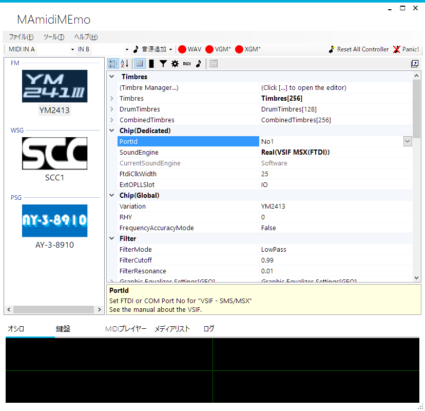


### MAmiMEmo (MAmi)の実機演奏機能

VSIF接続で各種コンソールやマイコンの実機に搭載された音源チップをPCからリモートで制御する事が可能です。

1. [VSIF dongle](#mami-vsif-dongle-for-msx) を使って、Windows PCから実機のジョイポートへコマンドを送信します。
2. MSXではMAmidiMEmo付属の```VSIF/VGM_msx.rom```を実行し、ジョイポートへ送られてくるコマンドを受信しながら実行する仕組みです。

> [!NOTE]
> RPCという仕組みを使用してopenMSXからMAmidiMEmoへコマンドを送ると、OpenMSXからのコマンドをMSX実機が実行する形になります。
>
> (openMSX -> MAmidiMemo -> VSIF dongle -> MSX実機)
> 
> 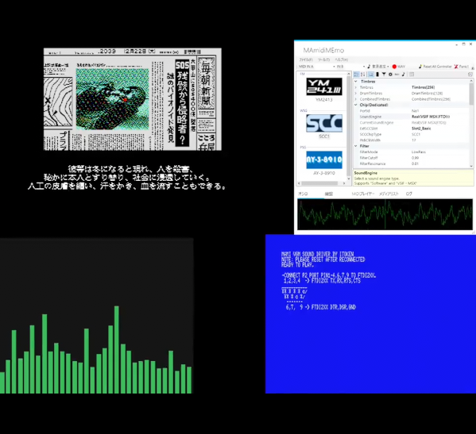

> [!NOTE]
> このRPC機能を利用するためにopenMSXを改造したものが
> [openMSX for MAMI](#openMSX-for-mami) です

### MAmiMEmo (MAmi)への演奏入力

1. MIDI入力

   MAmidiMEmoは入力としてMIDI入力が使えます。

2. RPC接続

   RPC呼び出しを使用して他のアプリケーションからMAmidiMEmo経由で音源チップの制御をすることもできます。

   起動時に```-chip_server```オプションを付けて起動すると、RPC接続可能なサーバとして動作し、他のアプリケーションからMAmidiMEmo経由で音源制御をできる状態になります。

3. VGMPlayer

   同梱のVGMPlayer.exeもVSIF対応で、ドングル接続した実機にVGMファイルを演奏させる事が出来ます。

4. ソフトウェア鍵盤

   ソフトウェア鍵盤も装備しています。  
   試しに鳴らしたい時にも使えます。

### MAmiMEmo (MAmi)のSoftware音源

MAMEベースのSoftware音源も搭載していますので、MAmidiMEmo単体でも音を鳴らすことができます。

ただし、YM2413のエミュレーションはNuked-OPLLやokaxaki emu2413最新版に比べると精度が落ちます。

例えば、リズム音源モードの特殊な使用方法では実チップと違う動作をすることが確認されています。

> [!NOTE]
> **YM2413 リズム音源の特殊な使い方**
> 
> 1. モードビットだけをリズムモードに変え、リズム発音制御ビットは固定
> 2. メロディモードと同じ方法で発音制御を使用する
> 3. ハイハットやタムタムは音色番号が音量になる。（0が音量最小）
>     
>    ただし音源ドライバによって@nとレジスタに書き込まれる値の対応は異なる。
>    
>    例えばMGSDRVは＠0がレジスタ値では1でv14相当、＠14がレジスタ値では15でv0相当）
> 
> という方法があります。
> 
> この方法を使うと特殊ではない音源ドライバのMMLでもリズム音源の周波数（LFOやポルタメント）、サスティンの制御が簡単に記述できるため、それなりに使用されています。
>
> 実際の所、リズム音源モード用のサスティン制御やポルタメントやLFOのコマンドが使えるドライバは見たことがありません。（探せばあるかもしれませんが）

----

## MAmi-VSIF dongle for MSX

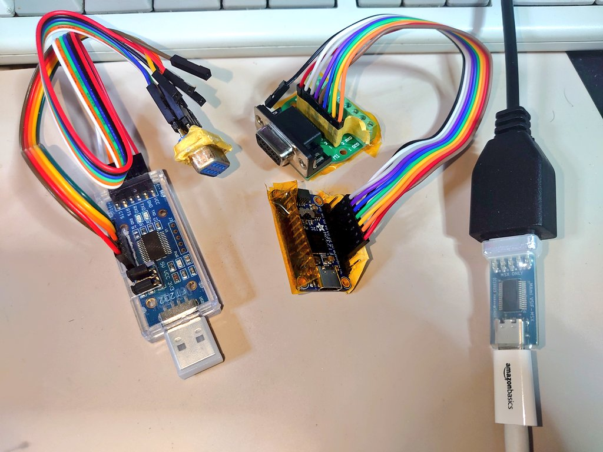
左から順に
- FTDI FT232RQを使用したスタンダード版の自作品
- FTDI FT232HQを使用した高速版の自作品
- にがさんが頒布されている完成品（FTDI FT232RQ採用）

### にがさん謹製「MAmi-VSIF dongle for MSX」  

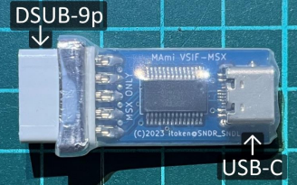

[MAmi-VSIF dongle for MSX 使用説明書](http://niga2.sytes.net/sp/mami_msx.pdf)

これはPCからMSX/P6へジョイポート経由でデータを送信できるドングルです。

> [!Note]
> MAmi-VSIF dongle for MSXはFTDI社のFT232というUSB接続のシリアル通信（UART）インターフェースを使用しています。  
> FTDIのUARTチップはパラレル送信モードも持っていて、それを使ってジョイポートへパラレル通信でコマンドを送ります。
> コマンドは実機のジョイスティックポートへ送られるので、実機側はこれを監視しながらコマンドを実行する形です。
>
> メガドライブやSMS用も原理は同じものです。


（ドングルはMSXとP6共通です）

#### 入手方法

- 通信販売：[家電のケンちゃん MAmi-VSIF dongle for MSX 販売ページ](https://www.kadenken.com/view/item/000000001540)
- MSXイベントやX68Kイベントなどでの販売（委託販売が多いので適宜検索ください）

こちらがあれば面倒な工作不要で手軽にPCとMSXを接続できますし、作りもコンパクトでしっかりしているので取り扱いも安心です。

完成済みdongleが入手できない場合は自作することもできます。

----

## MAmi-VSIF dongle の自作

  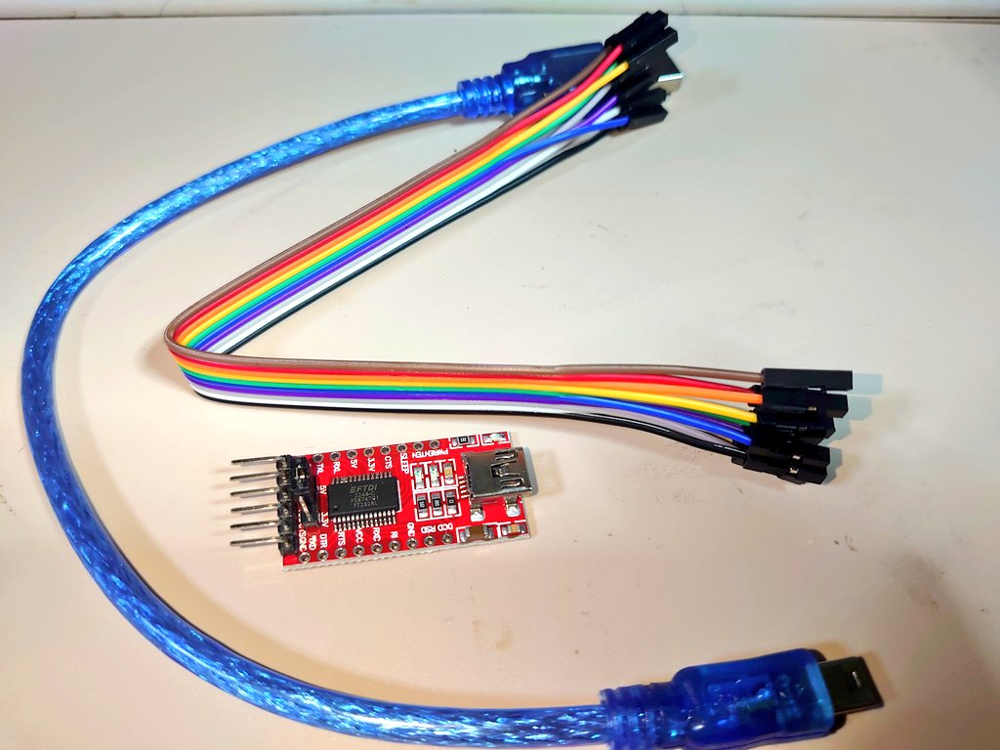

完成済み MAmi-VSIF dongle for MSX が入手できない場合は、自作することもできます。

MAmi-VSIF dongle の基本は、FTDI社のUSB-UARTアダプタに搭載されているBit Bang機能使い、パラレルデータを送る仕組みです。

MSXに信号を送るので5Vで動作する事が要件で、**5V電源入力**モードがあることが望ましいとの事です。

作者のitokenさんは FT232RQ をお勧めされています。

> [!NOTE]
> 自作するとそれなりに大変なので、  
> にがさんの完成品を入手するのがオススメです。  
> とても楽だし、取り扱いも安全です。

### MAmi-VSIF dongle 自作の為に用意する物

1. FTDI FT232RQ 
2. ジョイスティックケーブル または、D-SUB 9pinメスコネクタと配線
3. USBケーブル（タイプはFTDIにあうもの。付属していることが多い）

> [!CAUTION]
> #### **電源入力モードが無い FT232 にご注意！**
> 
> FT232シリーズ を使用したキットやケーブルの中には、電源出力モードしか設定できない物もありますので、電源入力モードがあるか確認してからご購入ください。
> 
> 設定変更できるかはFT232のチップではなく基板実装に依存します。
> 
> 例） [秋月電機通商 FT232RQ USBシリアル変換モジュールキット](https://akizukidenshi.com/catalog/g/g109951/) 

> [!NOTE] 
> #### **FT232H (高速な上位モデル)の使用について**
> 
> FTDI FT232R の代わりに、高速な上位モデルである FTDI FT232H なども使用できます。
> 
> ただし、高速動作するものはそのままの設定ではMSXのZ80が追い付きません。  
>
> 例えば FT232H を使用する場合は、```FtdiClockWidth```の設定を大きめの```35```にする必要があります。  
>
> 実機がR800モードで動作しているのであれば ```FtdiClockWidth```を```20```まで減らすこともできます。  
>
> 参考: [R800モードでの使用](#r800モードでの使用)

FT232RQ か FT232HQ あたりがお手ごろだと思います。

### MAmi-VSIF dongle の 組み立て

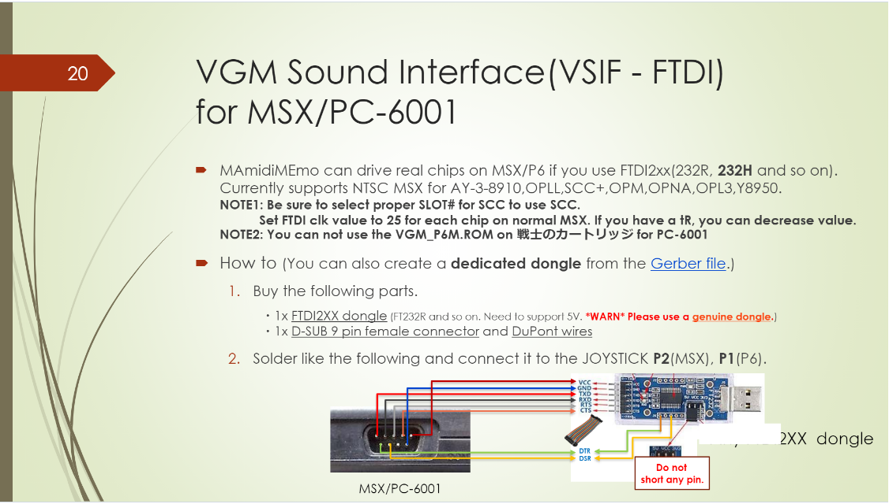

https://github.com/110-kenichi/mame/blob/master/docs/MAmidiMEmo/Manual.pdf


MSX側（オス）コネクタ  
```
＼1 2 3 4 5／
 ＼6 7 8 9／
 ```  

ジョイスティックケーブル側（メス）コネクタ  
```
＼5 4 3 2 1／
 ＼9 8 7 6／
 ```  

| FT232    | MSXジョイポート2 端子 |
|:-------- |:--------------------- |
| VCC      | 5 (+5V)               |
| GND      | 9 (GND)               |
| TXD (D0) | 1                     |
| RXD (D1) | 2                     |
| RTS (D2) | 3                     |
| CTS (D3) | 4                     |
| DTR (D4) | 6                     |
| DSR (D6) | 7                     |

MAmiはFTDIをBit–Bang モードで使用し、  
MSXに対して6bitパラレル送信を行う形になります。

- 自作例1 :
  
  FTDI FT232RQ、DSUB9ピンメスコネクタ加工、テストワイヤ、テストピンソケット

  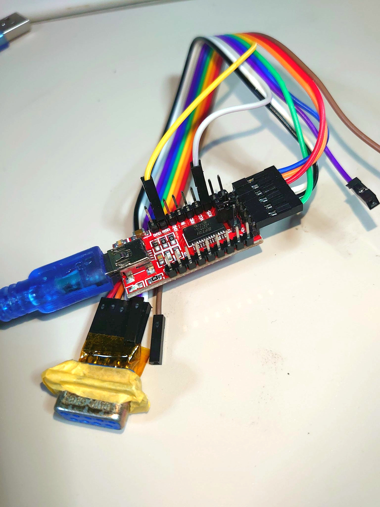

  ※ テストワイヤで組み換えしやすくした結果🤤
  - ケースに収まらなくて困っている
  - たまに線が抜ける

  ※ DSUB9ピンコネクタのエラ部分を削った結果🤤
  - バラバラになったのでテープで無理やり接合
  - ハンダで溶接は無理

- 自作例2：
  
  FTDI FT232HQ、DSUB9pinメス基板、テストワイヤ、テストピンソケット

  - このFTDI FT232HQキットには **VCC入出力モードを変更可能なジャンパやスイッチが無かった**ので、FT232H VCC→MSX 5番 を接続していません。(この写真だとFT232側のVCCピンからコードを外しています) 

  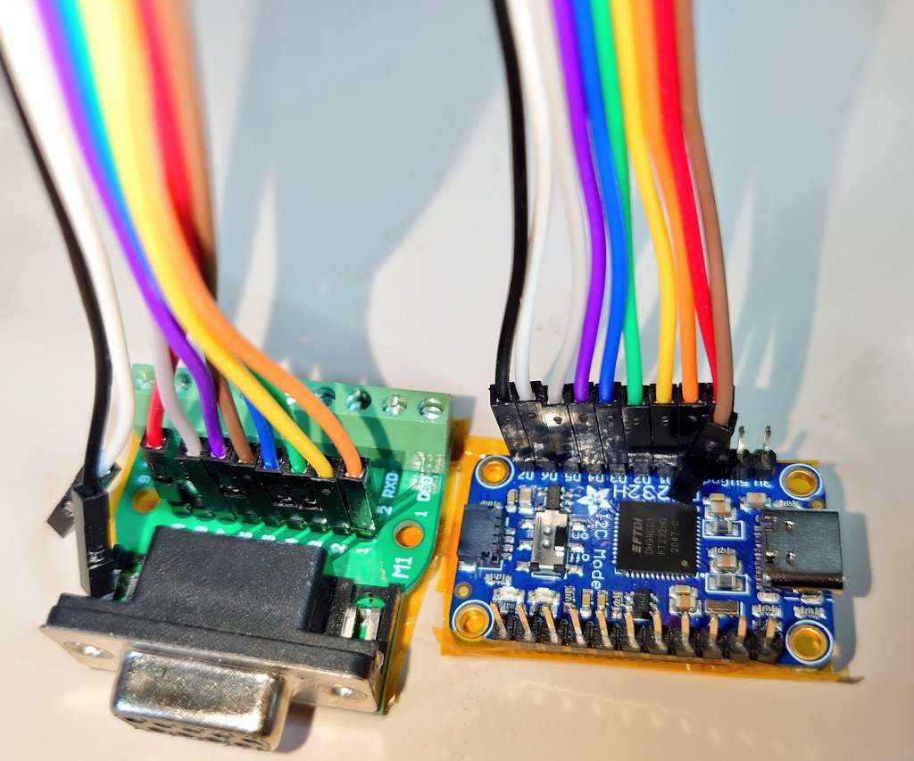

  ※ テストワイヤで組み換えしやすくした結果🤤
  - ケースに収まらなくて困っている
  - たまに線が抜ける

### 要注意：VCC端子の入力/出力モードについて

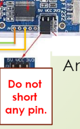

MAmidiMEmoでの使用では、 FTDI FT232R がMSX側からの+5V給電で動作することを想定しています。

FTDI FT232R の出荷状態ではジャンパピンのVCCと5Vか3.3Vがショートされた状態が多いと思います。

この状態だと FT232 のVCCが入力ではなく出力モードになっていて**危険**ですので、**必ずショートピンを外してください。**

> [!CAUTION]
> 
> - FT232 のVCC端子が出力モードの場合、 FT232 は（MSXの電源と無関係に）USB給電で動作します。
>   この状態でMSXに接続すると損傷や不具合が出るかもしれません。
> 
> - MSXに接続せずに動作確認をしたい場合  
> （つまりF232をUSB給電で動作させたい場合）は
>   1. MSXにはつながずに
>   2. VCC出力モードにします

### 要注意：VCC入力モードに切り替えられない物

中にはジャンパピン自体が無いか、出力以外の設定が無い物もあります。

その場合は仕方ないので、**FT232 のVCCとMSXの+5Vの接続を外して**使用して下さい。

> [!WARNING]
> ※ USB給電モード（VCC出力モード）での使用自体、**最悪、本体が壊れる**可能性があります。

USB給電モードで FT232 のVCC端子とMSXジョイポートの+5V端子が繋がっていると、**ジョイポート2 を通して FT232 から本体へ+5Vが給電されます。**

この状態ではMSXの電源スイッチを切ってもMSXが動作し続けますし、 FT232 、MSX共にリスクがあります。

----

## MAmi-VSIF dongle の動作テスト

参考：
https://x.com/SNDR_SNDL/status/1590295847333670914

### FTDI FT232から信号を出すツール

**Bit Bang Test**  
https://feng3.nobody.jp/soft/bbt.html

FTDI UARTケーブルのBit Bangモードを操作できるツールを使用します。

### PC側(FT232)単体のテスト

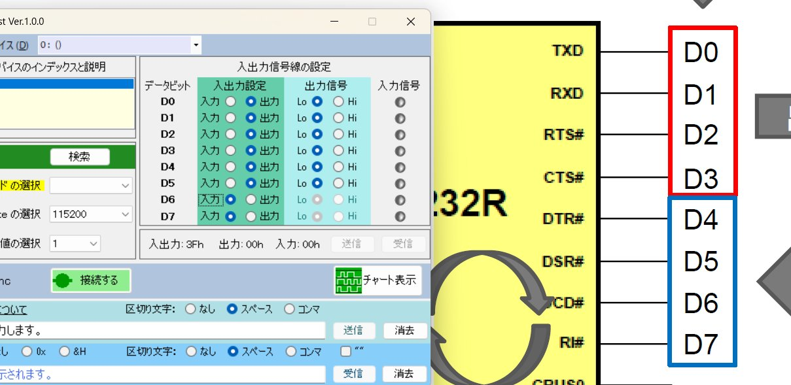

1. FTDI FT232 の電源はMSX側からではなくUSBから5Vを供給  
   （FT232 のジャンパVCCと5Vをショート）
2. FTDI FT2332 をPCのUSBポートに接続
   
3. FTDI FT2332 はMSXには繋げない
   
4. Bit Bang Test で接続確認
   Bit Bang Testの「接続」ボタンを押して接続  
   --> ボタンが「切断する」に変化すればOK

5. Bit Bang Test で出力確認
   1. Bitモードを```Asynchronus```に設定
   
   2. 入出力設定の```D0```～```D5```をHi/Lo切替  
      例)
      1. データビット```D0```～```D5```を出力に設定し全てLoで送信
      2. ```D0```から```D5```について一つずつHiにして送信
   
   3. アタリ端子側のHi/Lo状態を確認  
      例) テスターを用意して確認する場合  
      - ```Hi```だと```5V```
      - ```Lo```だと```0.9mV```

### MSX側で入力を確認するツール

**HIDTest**  
ジョイポートの状態を表示するMSX用ツール

ダウンロード先：
FRS' MSX Page  
https://frs.badcoffee.info/tools.html

HIDtest v3.2 executable 直接リンク  
https://frs.badcoffee.info/files/HIDTEST.ZIP

ジョイポート2の検査をする場合、DOSプロンプトから
```
>hidtest /G 2
```
で起動


### MSXと接続してテスト

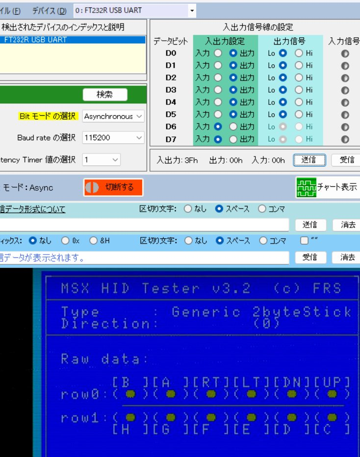

参考：
https://x.com/SNDR_SNDL/status/1590536937081049088

1. FTDI FT232 の電源はMSX側から5Vを供給  
   - FT232 のジャンパVCCをショートさせない
   - ジャンパが無い場合はMSX側の5番ピン(5V)、FT232のVCCピンを接続しない
2. FTDI FT2332 をPCのUSBポートに接続
   
3. FTDI FT2332 をMSXの **ジョイポート2** に接続
   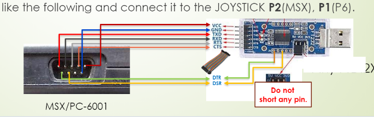
   
4. Bit Bang Test で接続確認
   Bit Bang Testの「接続」ボタンを押して接続  
   --> ボタンが「切断する」に変化すればOK

5. MSXを起動して、MSX-DOSからhidtestを実行
   ```
   >hidtest /G 2
   ```

6. Bit Bang Test で出力確認
   1. Bitモードを```Asynchronus```に設定
   
   2. 入出力設定の```D0```～```D5```をHi/Lo切替  
      例)
      1. データビット```D0```～```D5```を出力に設定し全てHiで送信
      2. ```D0```から```D5```について一つずつLoにして送信
   
      3. MSXの```HIDtest```で **ジョイポート2**端子側のHi/Lo状態を確認  
         **BitBangTest**を```D0```～```D5```を一つずつ順次Loにして**出力**する毎に  
         **HIDtest**の表示が
         **上 下 左 右 A B** の順番でONへ変化すればOK

         | FT232    | MSXジョイポート2 端子 |
         |:-------- |:--------------------- |
         | VCC      | 5 (+5V)               |
         | GND      | 9 (GND)               |
         | TXD (D0) | 1                     |
         | RXD (D1) | 2                     |
         | RTS (D2) | 3                     |
         | CTS (D3) | 4                     |
         | DTR (D4) | 6                     |
         | DSR (D6) | 7                     |

----

## openMSX for MAMI

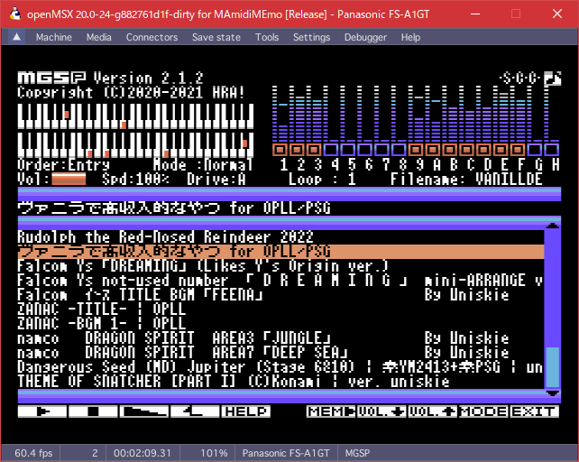

MAMIの為に改造したopenMSXです。

https://github.com/uniskie/openMSX/releases  
こちらからダウンロードください。

ソースコードは  
https://github.com/uniskie/openMSX/

設定方法などはバージョンが大分古い記事ですが  
https://uniskie.hatenablog.com/entry/ar1939918  
をご参照ください。

openMSXの設定や動作確認が終わったら、
openMSXは一度終了させて下さい。

以降は、MAmidiMEmoを起動してからopenMSXを起動する  
という手順になります。

----

# 接続と設定

## VSIF dongle の 接続

Windows PCのUSBポート→ MAmi-VSIF dongle for MSX → MSXのジョイポート2

という形で接続して使用します。
音源設定のportIDは基本的にデフォルトの1で自動認識してくれます。

## MSX側 の 受信準備

MAmiMEmoに添付の```VSIF/VGM_msx.rom```をMSX側で実行しておきます。  
書き込み可能なROMやROMローダーで実行してください。

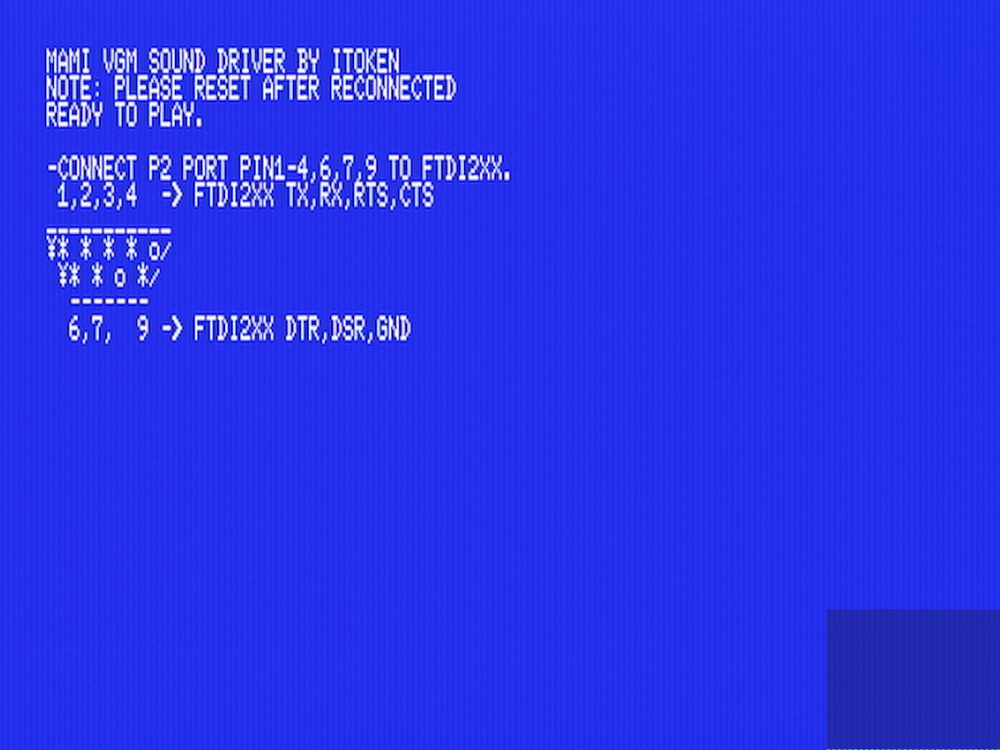


### R800モードでの使用

ROMイメージを書き込んだROMカートリッジで起動した場合は、Z80で動作します。

```VGM_msx.rom```にCPU切替処理は入ってなかったと思います。
最新版は対応しているかもしれませんが未確認です。

R800で動かしたい場合は

1. Nextor/MSX-DOS2を R800モードで起動
2. 各種ROMローダー(NSLOAD、MGLOAD、SofaRun)を使用して  
   ```VGM_msx.rom```を起動

## Windows側 の 送信準備

### MAmidiMEmo の起動


```
MAmidiMEmo.exe -chip_server
```

でMAmiをチップサーバ機能有効で起動します。

この時、PCにMIDI入力デバイスが無いと確認ダイアログが出て、OKを押すまで起動しないのですが、全てのウインドウの裏に隠れて見えなくなることが良くあります。

なるべく他のウィンドウを隠してデスクトップが表示される状態で起動してください。

#### MAmidiMEmo の 音源設定

MAmiは最初音源が無い状態なので、音源の追加をしてください。
- FM : YM2413
- WSG : SCC1
- PSG : AY-3-9820

を追加します。

> [!NOTE]
> 
> **MSX-AUDIO**
> 
> MSX-AUDIOはopenMSX for MAMIでの対応をし忘れてたので使えません。
>
> VGMPlayer.exeから演奏する場合や、MAmiのMIDI制御で鳴らす場合は鳴ります。

音源を追加したら各音源を選択肢して、音源の設定を行います。

1. ```SoundEngine```

   デフォルトは```Software```
   
   VSIF dongle経由で実機演奏する場合は、  
   ```Real(VSIF MSX(FTDI))```に変更します。

2. ```FtdiClockWidth```

FTDI FT232 3Rならデフォルトの```25```  
   （MAmi-VSIF dongle for MSXは FTDI FT232 3Rです）

> [!NOTE]
>
> **FTDI FT323Hの場合**
> 
> FT232H は速度自体が早いのでウェイトも多めに必要です。
> 1. MSXがZ80で動作中なら推奨値は```35```
> 2. MSXがR800で動作中なら```20```～```25```  
>    (推奨値未確定)

> [!NOTE]
>
> **FT232R + R800モード**
>
> FTDI FT232R の場合はMSXがR800で動作中でも FTDI FT232R が追い付かないのでZ80向け同様に```25```推奨です。

> [!NOTE]
>
> ```FtdiClockWidth```は推奨値-2ぐらいなら一応動きますがたまにフリーズします。

3. ```SCCChipType```

   SCCサウンドカートリッジなら

   1. ```SCC1``` (フルスペック)
   2. ```SCC1_Compat``` （ゲーム組み込み版互換モード）

   のどちらかを選択。

   それ以外なら```SCC```を選択します。

4. ```ExtSCCSlot```

   複数SCCがある時にスロットを指定できます。

5. ```portID```

   音源設定の```portID```はVSIF dongleのポート指定です。  
   基本的にデフォルトの```1```で自動認識してくれます。

   逆にこれでうまくいかない時の対処法は分かりません🤤


### openMSX for MAMI の起動

1. MAmidiMEmoが起動したのを確認したら、  
2. 次にopenMSX for MAMIを起動します。

> [!CAUTION] 
> **この手順は守ってください。**
> 
> 先にopenMSXを起動するとopenMSXからMAmiへ接続されません。

> [!NOTE]  
> MAmiを複数起動している場合、2つ目以降は待ち受けポート番号が変わってしまうので、それらには接続できません。

#### openMSX for MAMI と MAmidiMEmo の接続確認

ここで一旦 openMSX for MAMI と MAmidiMEmo が接続されているかどうか確認してください。

上手くいっていればMSXから音が鳴ると思いますが、上手く鳴らない時は問題の切り分けの為、MAmidiMEmo側に届いているかをまず確認します。

1. Mamiの音源リストから```PSG```を選択
2. ```SoundEngine```を```Software音源```に一時変更
3. オシロスコープを表示
4. openMSXでBEEP音を鳴らす  
   (BASICプロンプトでCTRL+G)

等で確認するのが簡単です。

openMSXからMAmiへの接続が上手くいかない場合は、

1. MAmidiMEmoの起動時に```-chip_server```を付けて起動しているか
2. MAmidiMEmoを多重起動していないか

などを確認してみてください。

----

## 準備完了

以上で準備完了です。

すべての準備が整っていれば、openMSXと同期して実機から音が出ると思います。

これで、実機でしか味わえない独特の厚みのあるSCC音源や、フィルタの聞いた太くて丸みのあるOPLLの音が楽しめます。

おめでとうございます。

- [幻影都市 with VSIF](img/illution_city_vsif.mp4)
  
  https://github.com/user-attachments/assets/c5d2a7ca-e51f-4879-8bf6-3d8b6f778264


### SCC音源 の 違い

SCC特有のノイズは音色データ読み取り時に  
SCCチップ側から読み取れないタイミングがあることが原因で、  
そのタイミングが2種類あるとの事だそうです。

1. MSXのプログラム実行状態に関係するタイミング（プログラム実行状態で変化）
2. 関係ないサイクル（ある程度周期的）

この場合、2だけ現物と一致する形ですが、エミュレータよりは全然音の違いが少ないと思います。  
（2が原因の波形変化は常に起きている物なので）

例えばグラディウス2β版だと音が微妙に違ったりするのは1のほうの違いなんでしょうかね。


- [スナッチャー with VSIF](img/snatcher_vsif.mp4)

  https://github.com/user-attachments/assets/0da5e1cc-998a-42d6-901b-2e3cac482df0

- [グラディウス2 with VSIF](img/gradius2_vsif.mp4)
 
  https://github.com/user-attachments/assets/4ba3d576-e093-4402-9fca-171a66a9f670

----

## 演奏がもたつくケース

たまに無茶な事をしてるソフトで対処が難しいものがあります。

https://x.com/uniskie/status/1590672732685238274

1. パロディウス：タコ（主人公）の通常ショット
2. グラディウス：レーザー

- [パロディウス with VSIF](img/parodius_vsif.mp4)

  https://github.com/user-attachments/assets/da230690-58fd-40cc-a211-a7fddf8632c1

これらは

1. 一瞬だけミキサーでミュート
2. 数ステート後にミュート解除

という処理が入っているため、MAmi VSIFの速度ではちょっと追いつきません。

そのため一瞬音がハッキリ消えるので音がもたついたように感じます。

FT232H で制作したVSIF dongleであれば多少緩和されることを確認していますが、完全には解決しないようです。

----

## (おまけ) openMSXでVGM録音

### openMSX コンソール

```F10キー```でコンソールを出して各種コマンドを入力します。

### vgm_rec コマンド

- HELP表示
  ```
  help vgm_rec
  ````

- 録音開始
  ```
  vgm_rec start <MSX-Audio|MSX-Music|MoonSound|PSG|SCC>
  ```

- 現在録音中のトラックを区切って次のトラックに録音開始
  ```
  vgm_rec next
  ```

- 録音終了
  ```
  vgm_rec stop
  ```

----

## 忘れてた

（初めて動作したときの感想より）

> リセット時やポーズのミュート制御、
> ステートロードへ波形メモリ転送の特殊処理を追加、あたりを追加して常用させていただこうかと思います。

完全にわすれてた

- ポーズをかけると音が鳴りっぱなしになる
- ステートロードをするとSCC波形がおかしくなりがち

対応してません

面倒くさそう🤤


