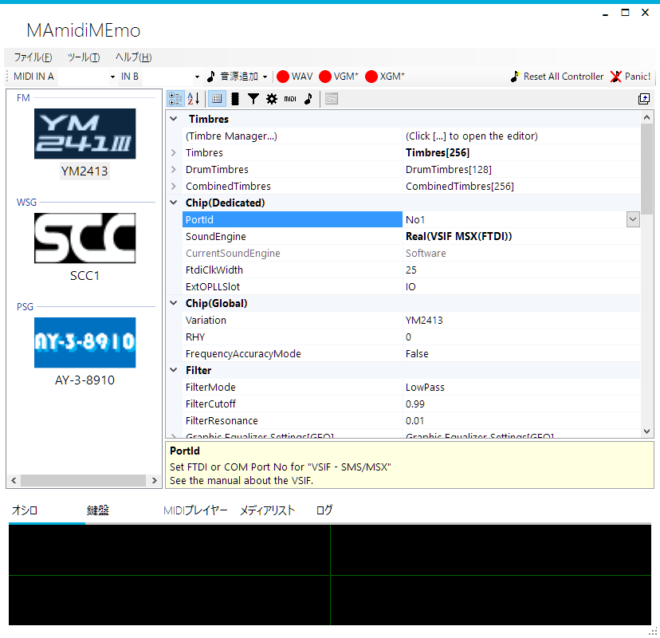
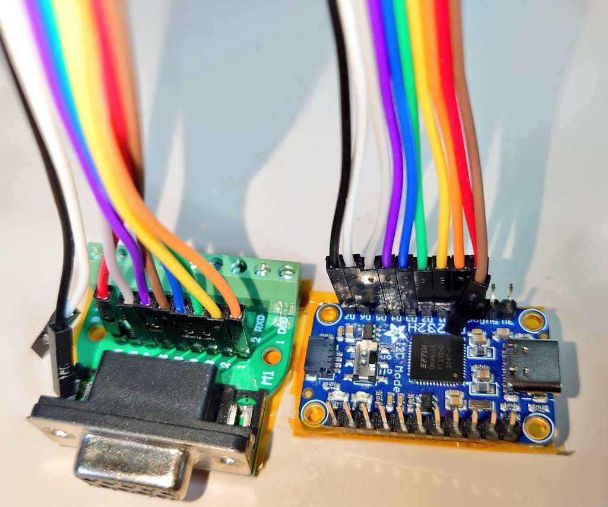
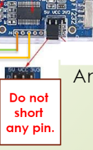

# MAmidiMEmo no MEMO

OpenMSX for MAMI、MAmidiMEmo、MAmi-VSIF dongleを使用し、OpenMSXエミュレーション中の音を実機で鳴らすまでのメモ。

SCC音源のノイズをエミュレーションできている物は存在しないため、スナッチャーやグラディウスの音がエミュレーションサウンドだと雰囲気が足りなくて寂しい。

そんな貴方に最適なソリューションを提供いたします。

----

# 準備編

----

## MAmiMEmo (MAmi)
https://github.com/110-kenichi/mame/

itokenさん制作のMAMEベースのチップ音源向けMIDIコントロールアプリケーションです。（Windows用のみ）

物を揃えれば、PCからMIDI制御でMSXやMD実機演奏したり、エミュレータで遊びながらチップ制御情報を実機にリアルタイム転送して演奏させる事も出来ます。

略称はMAmi、MAMI、mamiです。



### MAmiの実機演奏機能

VSIF接続で各種コンソールやマイコンの実機に搭載された音源チップをPCからリモートで制御する事が可能です。

その場合は [VSIF dongle](#mami-vsif-dongle-for-msx) を使用してWindows PCと実機を接続します。

実機側ではVSIFフォルダにある各機種用のROMや実行ファイルを実行してMAmidiMEmoからの音源制御コマンドを受信し実行します。

MSX用であればMAmidiMEmo付属の```VSIF/VGM_msx.rom```を使用します

> [!NOTE]
> この機能とRPCサーバ機能を使ってOpenMSXの音を実機で演奏させる事が出来ます。

### MAmiへの演奏入力

1. MIDI入力

   MAmidiMEmoは入力としてMIDI入力が使えます。

2. RPC接続

   RPC呼び出しを使用して他のアプリケーションからMAmidiMEmo経由で音源チップの制御をすることもできます。

   起動時に```-chip_server```オプションを付けて起動すると、RPC接続可能なサーバとして動作し、他のアプリケーションからMAmidiMEmo経由で音源制御をできる状態になります。

   > [!NOTE]
   > このRPCサーバ機能を利用するための改造をしたものが [openMSX for MAMI](#openmsx-for-mami) です

3. VGMPlayer

   同梱のVGMPlayer.exeもVSIF対応で、ドングル接続した実機にVGMファイルを演奏させる事が出来ます。

4. ソフトウェア鍵盤

   ソフトウェア鍵盤も装備しています。  
   試しに鳴らしたい時にも使えます。

### MAmiのSoftware音源

MAMEベースのSoftware音源も搭載していますので、MAmidiMEmo単体でも音を鳴らすことができます。

ただし、YM2413のエミュレーションはNuked-OPLLやokaxaki emu2413最新版に比べると精度が落ちます。

例えば、リズム音源モードの特殊な使用方法では実チップと違う動作をすることが確認されています。

> [!NOTE]
> **YM2413 リズム音源の特殊な使い方**
> 
> 1. モードビットだけをリズムモードに変え、リズム発音制御ビットは固定
> 2. メロディモードと同じ方法で発音制御を使用する
> という方法があります。
> 
> この方法を使うと特殊ではない音源ドライバのMMLでもリズム音源の周波数（LFOやポルタメント）、サスティンの制御が簡単に記述できるため、それなりに使用されています。
>
> 実際の所、リズム音源モードでのサスティン制御やポルタメントやLFOをサポートしたドライバは見たことがありません。 （探せばあるかもしれませんが）

----

## MAmi-VSIF dongle for MSX

にがさん謹製「MAmi-VSIF dongle for MSX」  
[MAmi-VSIF dongle for MSX 使用説明書](http://niga2.sytes.net/sp/mami_msx.pdf)

これはPCからMSX/P6へジョイポート経由でデータを送信できるドングルです。

（ドングルはMSXとP6共通です）

### 入手方法

- 通信販売：[家電のケンちゃん MAmi-VSIF dongle for MSX 販売ページ](https://www.kadenken.com/view/item/000000001540)
- MSXイベントやX68Kイベントなどでの販売（委託販売が多いので適宜検索ください）

こちらがあれば面倒な工作不要で手軽にPCとMSXを接続できますし、作りもコンパクトでしっかりしているので取り扱いも安心です。

完成済みdongleが入手できない場合は自作することもできます。

----

## MAmi-VSIF dongle の自作

完成済み MAmi-VSIF dongle for MSX が入手できない場合は、自作することもできます。

MAmi-VSIF dongle の基本は、FTDI社のUSB-UARTアダプタに搭載されているBit Bang機能使い、パラレルデータを送る仕組みです。

MSXに信号を送るので5Vで動作する事が要件で、5V電源入力モードがあることが望ましいとの事です。

作者のitokenさんはFT2323RQをお勧めされています。

### MAmi-VSIF dongle 自作の為に用意する物

1. FTDI FT232RQ
2. ジョイスティックケーブル または、D-SUB 9pinメスコネクタと配線
3. USBケーブル（タイプはFTDIにあうもの。付属していることが多い）

> [!CAUTION]
> **電源入力モードが無いFT232RQ**
> 
> FT232RQを使用したキットでも電源出力モードしか設定できない物もありますので、電源入力モードがあるか確認してからご購入ください。
> 
> 例） [秋月電機通商 FT232RQ USBシリアル変換モジュールキット](https://akizukidenshi.com/catalog/g/g109951/) 

> [!NOTE] 
> **FT232の高速バージョン**
> 
> FTDI FT232Rの代わりに、高速な上位モデルであるFTDI FT232Hなども使用できます。
> 
> ただし、高速動作するものはそのままの設定ではMSXのZ80が追い付きません。  
>
> 例えばFT232Hを使用する場合は、```FtdiClockWidth```の設定を大きめの```35```にする必要があります。  
>
> 実機がR800モードで動作しているのであれば ```FtdiClockWidth```を```20```まで減らすこともできます。  
>
> 参考: [R800モードでの使用](#r800モードでの使用)

FT232RQかFT232HQあたりがお手ごろだと思います。

### MAmi-VSIF dongle の 組み立て


https://github.com/110-kenichi/mame/blob/master/docs/MAmidiMEmo/Manual.pdf


MSX側（オス）コネクタ  
```
＼1 2 3 4 5／
 ＼6 7 8 9／
 ```  

ジョイスティックケーブル側（メス）コネクタ  
```
＼5 4 3 2 1／
 ＼9 8 7 6／
 ```  

- VCC: MSXジョイスティック端子の5 (+5V)
- GND: MSXジョイスティック端子の9 (GND)
- TXD (D0): MSXジョイスティック端子の1
- RXD (D1): MSXジョイスティック端子の2
- RTS (D2): MSXジョイスティック端子の3
- CTS (D3): MSXジョイスティック端子の4
- DTR (D4): MSXジョイスティック端子の6
- DSR (D6): MSXジョイスティック端子の7

MAmiはFTDIをBit–Bang モードで使用し、MSXに対して7bitパラレル送信を行う形になります。

- 自作例：FTDI FT232HQ、DSUB9pinメス基板、テストワイヤとテストピンソケットで組み換えしやすくした結果、ケースに収まらなくて困っている物  

  

  たまにはずみで線が抜けたりします🤤

### 要注意：VCC端子の入力/出力モードについて



MAmidiMEmoでの使用では、FTDI FT232RがMSX側からの+5V給電で動作することを想定しています。

FTDI FT232Rの出荷状態ではジャンパピンのVCCと5Vか3.3Vがショートされた状態が多いと思います。

この状態だとFT232のVCCが入力ではなく出力モードになっていて**危険**ですので、**必ずショートピンを外してください。**

> [!CAUTION]
> 
> - FT232のVCC端子が出力モードの場合、FT232は（MSXの電源と無関係に）USB給電で動作します。
>   この状態でMSXに接続すると損傷や不具合が出るかもしれません。
> 
> - MSXに接続せずに動作確認をしたい場合  
> （つまりF232をUSB給電で動作させたい場合）は
>   1. MSXにはつながずに
>   2. VCC出力モードにします

### 要注意：VCC入力モードに切り替えられない物

中にはジャンパピン自体が無いか、出力以外の設定が無い物もあります。

その場合は仕方ないので、**FT232のVCCとMSXの+5Vの接続を外して**使用して下さい。

> [!WARNING]
> ※ USB給電モード（VCC出力モード）での使用自体、**最悪、本体が壊れる**可能性があります。

USB給電モードでFT232のVCC端子とMSXジョイポートの+5V端子が繋がっていると、**ジョイポート2を通してFT232から本体へ+5Vが給電されます。**

この状態ではMSXの電源スイッチを切ってもMSXが動作し続けますし、FT232、MSX共にリスクがあります。

----

## MAmi-VSIF dongle の動作テスト


(工事中)
会話ログから抜粋


https://x.com/SNDR_SNDL/status/1590295847333670914

あとMAmi側の問題かどうかの切り分けのため、一旦MSXからケーブルは外し(PCだけに接続し)、他の方の作られたテストツールで接続できるかどうかご確認いただけますでしょうか？

Bit Bang Test  
https://feng3.nobody.jp/soft/bbt.html


https://x.com/SNDR_SNDL/status/1590345512976539649

結線は、先ほどのテストツールを使い(MSXには繋げず)、入出力設定のD0～D5をHi/Loさせ(1枚目)、アタリ端子側のHi/Lo状態を確認する(2枚目)と手っ取り早いはずです(電源はMSX側からではなくFTDI側から5Vを供給する用ジャンパを設定してください(3枚目、VCCを5Vにする)


ジャンパVCCと5Vをショート  
BitモードAsynchronus  
①データビットD0~D5を出力に設定し全てLoで送信  
②D0からD5について一つずつHiにして送信  
で、  
それぞれHiだと5V、Loだと0.9mV  
という感じでした。  

（MSXにつなぐときはジャンパをショートさせていません）  


https://x.com/SNDR_SNDL/status/1590536937081049088

結線とFTDIのテストとしてMSXのhidtest.comを使うとMSX側の状態も確認できます(こちらが便利かも)。

```
>hidtest /G 2
```

で起動、FTDIのD0～5がそれぞれ上,下,左,右,A,Bに対応してて、Loにして送信すると該当のボタンが押し下げられればOKとなります。


FRS' MSX Page  
https://frs.badcoffee.info/tools.html

HIDtest v3.2 executable  
https://frs.badcoffee.info/files/HIDTEST.ZIP


HIDTEST3.2は ```hidtest /G 2```で起動。  
D0~D5を出力HIでいったん出力。  
D0～D5を順次LOWで出力で上下左右ABが順番にON  
を確認しました。  

MamiはPSGで  
softowareからFTDI(VSIF MSX(FTDI))への変更。  
15から10飛ばして100までやってみたのですが、暴走（リセットまたは画面の色が変わる等）しますね～  

あ、分かりました。  
SX2をSDBIOSでturboR BIOS+T80（Z80モード）で起動してたのが原因かもです。  

Nextorコアではなく、  
SDを抜いて2MBモード(MSXDOS2)で起動したらPSGが鳴りました！  


----

## OpenMSX for MAMI

MAMIの為に改造したOpenMSXです。

https://github.com/uniskie/openMSX/releases  
こちらからダウンロードください。

ソースコードは  
https://github.com/uniskie/openMSX/

設定方法などはバージョンが大分古い記事ですが  
https://uniskie.hatenablog.com/entry/ar1939918  
をご参照ください。

OpenMSXの設定や動作確認が終わったら、
OpenMSXは一度終了させて下さい。

以降は、MAmidiMEmoを起動してからOpenMSXを起動する  
という手順になります。

----

# 接続と設定

## VSIF dongle の 接続

Windows PCのUSBポート→ MAmi-VSIF dongle for MSX → MSXのジョイポート2

という形で接続して使用します。
音源設定のportIDは基本的にデフォルトの1で自動認識してくれます。

## MSX側 の 受信準備

MAmiMEmoに添付の```VSIF/VGM_msx.rom```をMSX側で実行しておきます。  
書き込み可能なROMやROMローダーで実行してください。

### R800モードでの使用

ROMイメージを書き込んだROMカートリッジで起動した場合は、Z80で動作します。

```VGM_msx.rom```にCPU切替処理は入ってなかったと思います。
最新版は対応しているかもしれませんが未確認です。

R800で動かしたい場合は

1. Nextor/MSX-DOS2を R800モードで起動
2. 各種ROMローダー(NSLOAD、MGLOAD、SofaRun)を使用して  
   ```VGM_msx.rom```を起動


## Windows側 の 送信準備

### MAmidiMEmo の起動

```
MAmidiMEmo.exe -chip_server
```

でMAmiをチップサーバ機能有効で起動します。

この時、PCにMIDI入力デバイスが無いと確認ダイアログが出て、OKを押すまで起動しないのですが、全てのウインドウの裏に隠れて見えなくなることが良くあります。

なるべく他のウィンドウを隠してデスクトップが表示される状態で起動してください。

#### MAmidiMEmo の 音源設定

MAmiは最初音源が無い状態なので、音源の追加をしてください。
- FM : YM2413
- WSG : SCC1
- PSG : AY-3-9820

を追加します。

> [!NOTE]
> **MSX-AUDIO**
> 
> MSX-AUDIOはopenMSX for MAMIでの対応をし忘れてたので使えません。
>
> VGMPlayer.exeから演奏する場合や、MAmiのMIDI制御で鳴らす場合は鳴ります。

音源を追加したら各音源を選択肢して、音源の設定を行います。

1. ```SoundEngine```

   デフォルトは```Software```
   
   VSIF dongle経由で実機演奏する場合は、  
   ```Real(VSIF MSX(FTDI))```に変更します。

2. ```FtdiClockWidth```

   FTDI FT2323Rならデフォルトの```25```  
   （MAmi-VSIF dongle for MSXはFTDI FT2323Rです）

> [!NOTE]
>
> **FTDI FT323Hの場合**
> 
> FT232Hは速度自体が早いのでウェイトも多めに必要です。
> 1. MSXがZ80で動作中なら推奨値は```35```
> 2. MSXがR800で動作中なら```20```～```25```  
>    (推奨値未確定)

> [!NOTE]
>
> **FT232R + R800モード**
>
> FTDI FT232Rの場合はMSXがR800で動作中でもFTDI FT232Rが追い付かないのでZ80向け同様に```25```推奨です。

> [!NOTE]
>
> ```FtdiClockWidth```は推奨値-2ぐらいなら一応動きますがたまにフリーズします。

3. ```SCCChipType```

   SCCサウンドカートリッジなら

   1. ```SCC1``` (フルスペック)
   2. ```SCC1_Compat``` （ゲーム組み込み版互換モード）

   のどちらかを選択。

   それ以外なら```SCC```を選択します。

4. ```ExtSCCSlot```

   複数SCCがある時にスロットを指定できます。

5. ```portID```

   音源設定の```portID```はVSIF dongleのポート指定です。  
   基本的にデフォルトの```1```で自動認識してくれます。

   逆にこれでうまくいかない時の対処法は分かりません🤤


### openMSX for MAMI の起動

MAmidiMEmoが起動したのを確認したら、  
次にopenMSX for MAMIを起動します。

> [!CAUTION] 
> **この手順は守ってください。**
> 
> 先にopenMSXを起動するとopenMSXからMAmiへ接続されません。

> [!NOTE]  
> MAmiを複数起動している場合、2つ目以降は待ち受けポート番号が変わってしまうので、それらには接続できません。

#### OpenMSX for MAMI と MAmidiMEmo の接続確認

ここで一旦 OpenMSX for MAMI と MAmidiMEmo が接続されているかどうか確認してください。

上手くいっていればMSXから音が鳴ると思いますが、上手く鳴らない時は問題の切り分けの為、MAmidiMEmo側に届いているかをまず確認します。

1. Mamiの音源リストからPSGを選択
2. SoundEngineをSoftware音源に一時変更
3. オシロスコープを表示
4. openMSXでBEEP音を鳴らす  
   (BASICプロンプトでCTRL+G)

等で確認するのが簡単です。

OpenMSXからMAmiへの接続が上手くいかない場合は、

1. MAmidiMEmoの起動時に```-chip_server```を付けて起動しているか
2. MAmidiMEmoを多重起動していないか

などを確認してみてください。

----

## 準備完了

以上で準備完了です。

すべての準備が整っていれば、OpenMSXと同期して実機から音が出ると思います。

これで、実機でしか味わえない独特の厚みのあるSCC音源や、フィルタの聞いた太くて丸みのあるOPLLの音が楽しめます。

おめでとうございます。

- スナッチャー with VSIF  
   <video controls src="img/snatcher_vsif.mp4" title="スナッチャー with VSIF"></video>

- グラディウス2 with VSIF  
  <video controls src="img/gradius2_vsif.mp4" title="グラディウス2 with VSIF"></video>

- 幻影都市 with VSIF
  <video controls src="img/illution_city_vsif.mp4" title="Title"></video>

----

## 演奏がもたつくケース

たまに無茶な事をしてるソフトで対処が難しいものがあります。

https://x.com/uniskie/status/1590672732685238274

1. パロディウス：タコ（主人公）の通常ショット
2. グラディウス：レーザー

- パロディウス with VSIF
  <video controls src="img/parodius_vsif.mp4" title="パロディウス with VSIF"></video>

これらは一瞬だけミキサーでミュートし、数ステート後に再度ONという処理が入っているため、MAmi VSIFの速度ではちょっと追いつきません。
そのため一瞬音がハッキリ消えるので音がもたついたように感じます。

FT232Hで制作したVSIF dongleであれば多少緩和されることを確認していますが、完全には解決しないようです。

----

## 忘れてた

（初めて動作したときの感想より）

> リセット時やポーズのミュート制御、
> ステートロードへ波形メモリ転送の特殊処理を追加、あたりを追加して常用させていただこうかと思います。

完全にわすれてた

対応してません

面倒くさそうｗ

