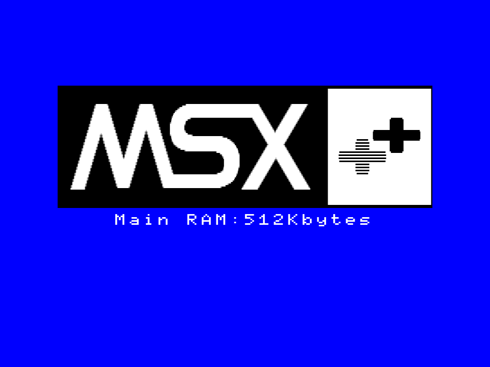

# MSX++ロゴ モダン風

## テスト：MSX3風 ドット表現

MSX3ロゴに合わせたデザインを作ってみました。

いざ実機のロゴ表示に組み込もうとすると圧縮データがサイズオーバーしてしまうので、実機表示は諦めました。

## A1GT向け 実機表示
[for A1GT](./for%20A1GT)

 
[HRA!さんの作成されたA1GT用のロゴ表示BIOS差し替え環境](https://github.com/hra1129/Alternate_BIOS/tree/main/boot_logo)
で使用できる画像ファイルです。

## OCM-PLD / A1WSX向け 実機表示
[for OCM](./for%20OCM)

OCM-PLD SDBIOS packやA1WSXで使用できる画像ファイルと変換環境のセットです。
