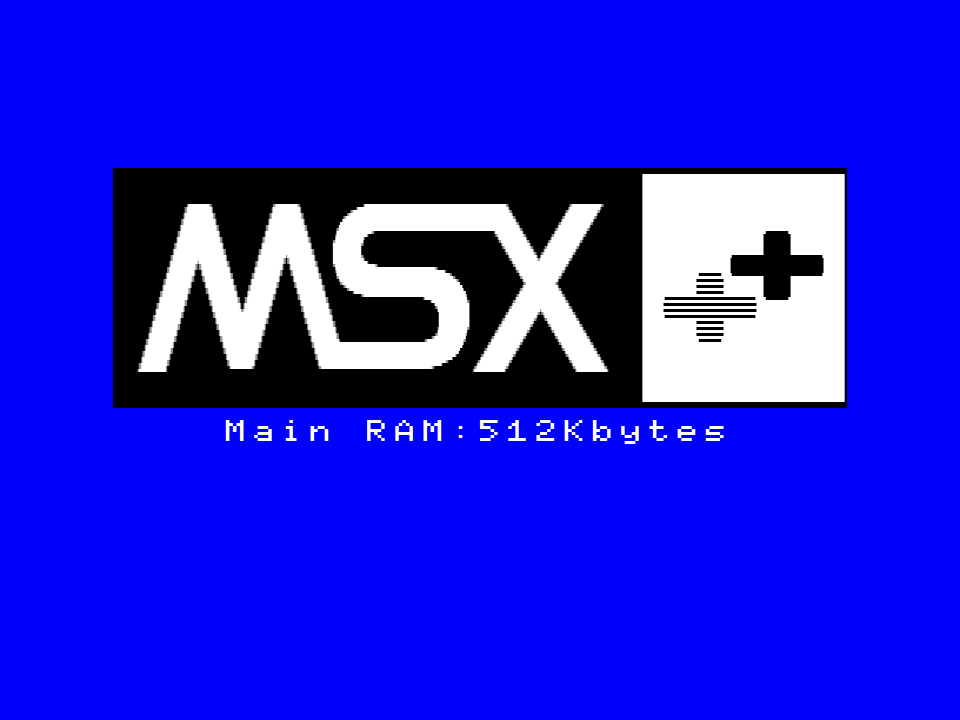

# A1GT用 差し替えロゴ：MSX++

HRA!さんの作成されたA1GT用のロゴ表示BIOS差し替え環境で使用できる画像ファイルです。

https://github.com/hra1129/Alternate_BIOS/tree/main/boot_logo

作成方法はHRA!さんのドキュメントを参照ください。

MSXturboR FS-A1GT の Slot#0-3 7900h-7FFFh

## FS-A1GT_irmware.rom 
Panasonic mapper という特殊な形式で格納されたシステムROM  
OpenMSXのmachine定義ファイル内では fs-a1gt_firmware.rom

firmware.rom 内での各ファイルの該当位置は以下の通りです。

1. altbios_boot_logo.bin ...$4B900
2. A1GTOPT.ROM ...$48000h

## A1GTOPT.ROM

A1GTOPT.ROM をそのまま使う環境ではそのまま置き換えに使えます。

- BlueMSX
- OCM-PLD SDBIOS pack

など

画像の改変流用はご自由に。
