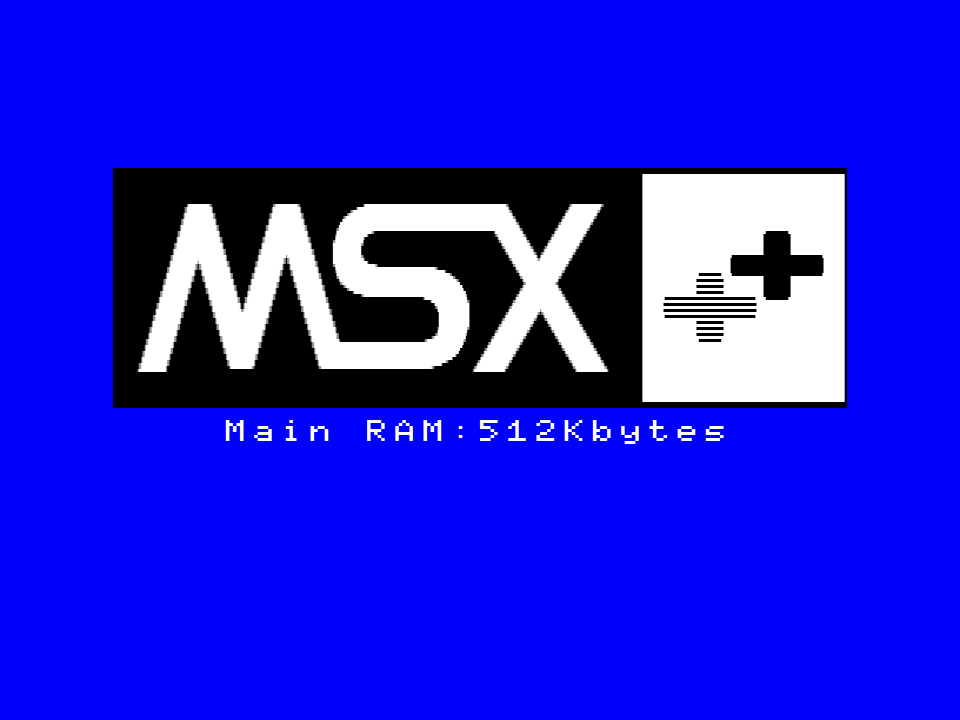
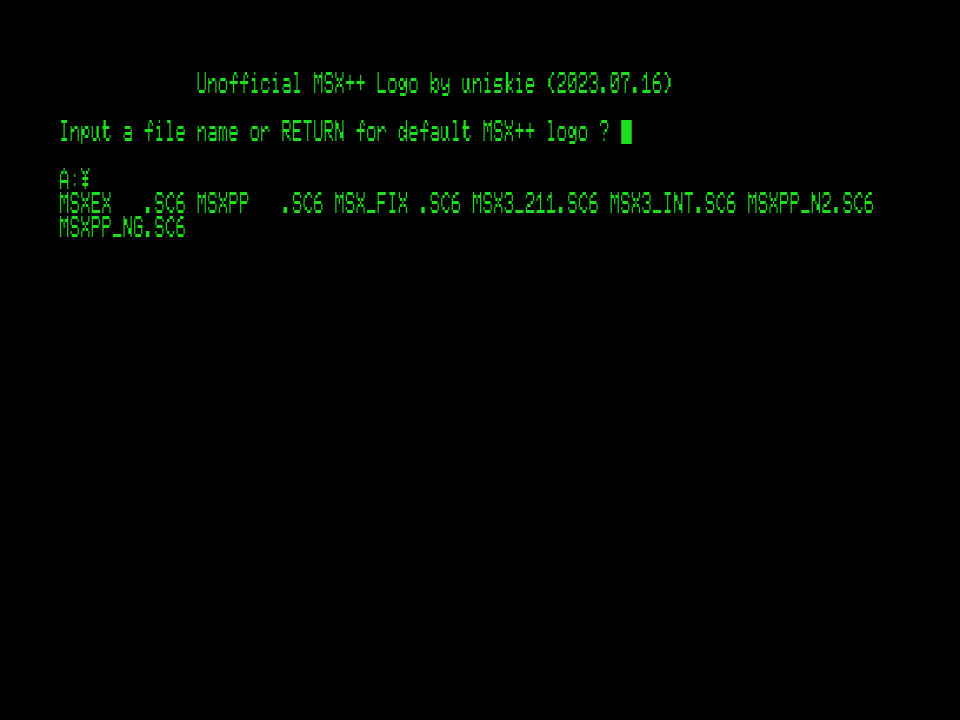

# 1chipMSX OCM-PLD SDBIOS用ロゴ差し替えデータ：MSX++

## LOGOMAKE.BAS

ファイル名には MSXPP⏎ または何も入力せずにリターンキーで変換開始します。

変換が終わると
- tab_7cb4.asm
- tab_7d3b.asm

が出力されます。

### MSXPP を変換した場合
MSXPP.ASM を テキストエディタで開き、
tab_7d3b.asm の内容を該当箇所にコピー&ペーストします。
tab_7cb4.asm はアンチエイリアス用データですが、MSXPPはデータが大きすぎて規定容量に収まらないのでアンチエイリアスを無効化しています。
tab_7cb4.asm は使いません。

### MSXEX を変換した場合
MSXEX.ASM をテキストエディタで開き、
tab_7cb4.asm と tab_7d3b.asm の内容を該当箇所にコピー&ペーストします。

## ASMファイルのアセンブル
  添付のASMファイルはTASM80用とのことなのですが、
TASMはMS-DOS用の16bitプログラムなので、64bit版WINDOWSでは動作しません。  
そのためDOSBox等から実行する形になります。

日本語が扱える派生版 DOSVAXJ3 がおすすめです。  
https://www.nanshiki.co.jp/software/dosvaxj3.html

mount C "Cドライブとして使いたいフォルダのパス"
などとして使用すると楽です。

TASMを今更使いたくなければ、.equや.dbをequやdbに置換してもらえれば他のアセンブラでもアセンブルできると思います。

### アセンブルの実行
> TASM -80 -b MSXPP.ASM

のように実行します。

すると
- MSXPP.lst
- MSXPP.obj

が出力されます。

lstファイルはアセンブル結果がテキスト出力されたテキストファイルです。  
ソースコード・バイナリ・アドレスが記載されているので、こちらを見て、7FFFHを超えていないかチェックします。

OBJファイルはバイナリファイルです。  
こちらの内容をROMファイルの該当箇所に書き込めばロゴ表示が変わります。

## BIOS ROM書き換え箇所

### OCMのSDBIOS pack

漢字BIOS kn??????.rom の $399d に書き込みます。

例) knmsxppl.rom

※内容的にはA1WSXの物と同じなので、A1WSXの漢字BIOSにも使用できます。

※ MSX2+の場合、機種によってロゴ表示プログラムの位置はバラバラなので、ほかの機種にはそのまま使えません。
