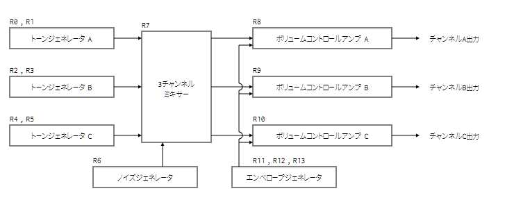

PSGでハードウェアエンベロープ(H.ENV)をそのまま、または半分の振幅で出せるという仕組みについてメモ

## PSG SPEC

- AY-3-8910相当品
- クロック 1.7897725MHz （NTSC 3.579545MHzを2分周）
- 音量 16段階
- 8オクターブ 3和音+ノイズ
- ハードウェアエンベロープを使用可能
- トーン出力周波数はクロック 1.7897725MHz をさらに16分周した 111860.78125Hz に対して、トーンレジスタで分周比を指定。
  分周比TPとしたとき、出力周波数 = (111860.78125 / TP) Hz

## PSGの基本構成

1. トーンジェネレータ → ミキサー  
   ノイズジェネレータ → ミキサー 
2. ミキサー → ボリュームコントロールアンプ  
    エンベロープジェネレータ  → ボリュームコントロールアンプ  

参考資料：  
https://d4.princess.ne.jp/msx/psg/  
https://f.rdw.se/AY-3-8910-datasheet.pdf  

## 最終出力

1. トーンミュート時 1.0×（音量またはハードウェアエンベロープ波形）
2. トーン有効時 矩形波×（音量またはハードウェアエンベロープ波形）

※ ノイズが有効ならさらにノイズを掛け算

### ポイント：ミュート時の出力

ミュートにするとミキサーは0ではなく1を出す。

つまり、ミュート時は

- ボリュームレジスタが0~15なら値そのままの出力レベル
- ボリュームレジスタが16ならハードウェアエンベロープそのままの波形

が、出力されるという特殊な発音が可能になっている。

## ハードウェアエンベロープの出力レベル

- トーンミュートにすると、ハードウェアエンベロープ波形 × 1倍
- トーンを混ぜた場合、ハードウェアエンベロープ波形 × 0.5倍  
  （※ 矩形波は平均すると出力レベル50%なので）

### トーンレジスタに2以下を指定した場合の特殊動作

分周比2や1（0指定時は1と同じ挙動）を指定すると50KHzや111KHzの成分が混じるが、この周波数域の音は音声フィルタ回路に弾かれる。  
フィルタに弾かれなかったとしても、人間には聞こえない。

結果として音量が半減したハードウェアエンベロープの波形だけが聞こえる。

> ※ ただし、エミュレータなどでは音声出力サンプリング周波数への変換でエイリアスノイズが微妙に発生して聞こえる事がある。

## 任意波形の生成 または、PCM再生

ハードウェアエンベロープをそのまま出力する技法と同様の方法（ミュートまたは分周比2以下のトーン）を使用して、ボリューム値(0～15)を高速に変更すれば、任意の波形を出力可能。

ただし、CPUの命令速度限界以上の周波数は出せない。

> MSXのZ80は基本クロックがNTSC 3579540Hz

これを利用して、4bit PCMを実現している例などがある。  
音量カーブが対数曲線であるのと、分解能が十分ではないため、複数チャンネルを併用したPCM再生もあるとのこと。

### 与太話

最速を考えた時、  
OTIRを使えば21ステート → 3579540 / 21 = 約140KHz 

だが、256サンプルしかこの速度を維持できないので現実的ではない。

