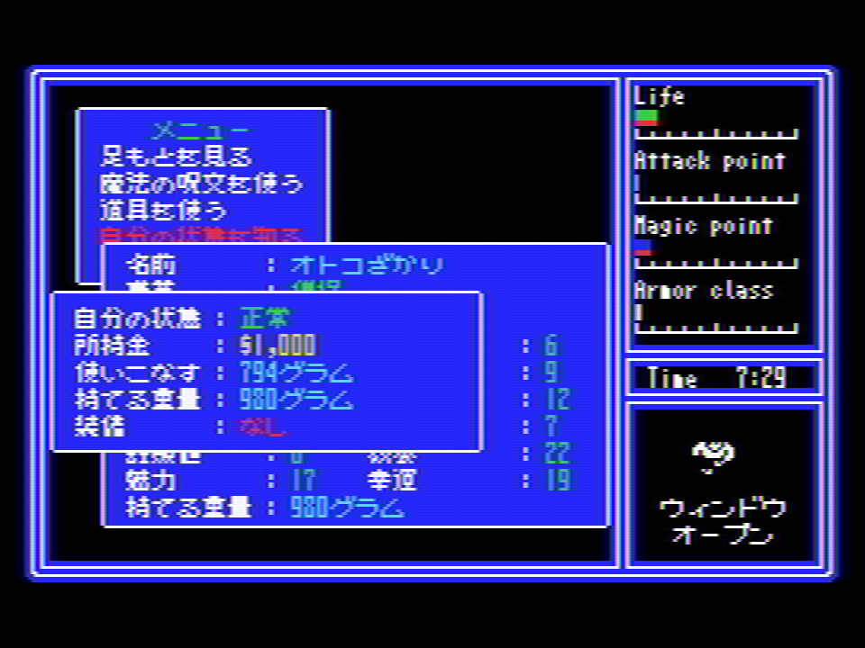
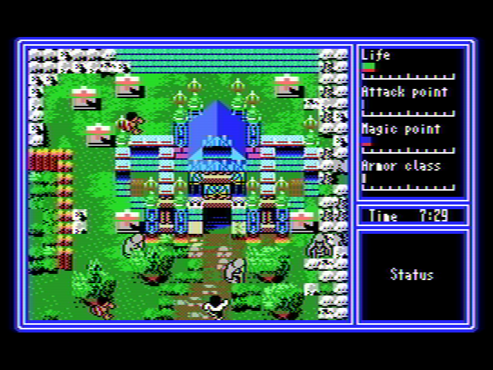
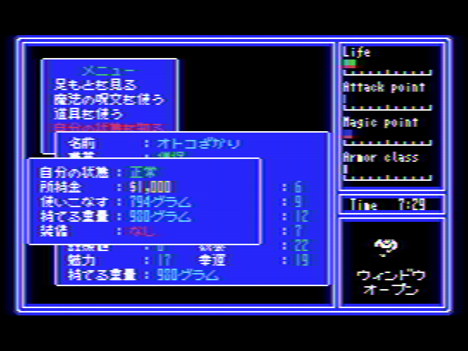
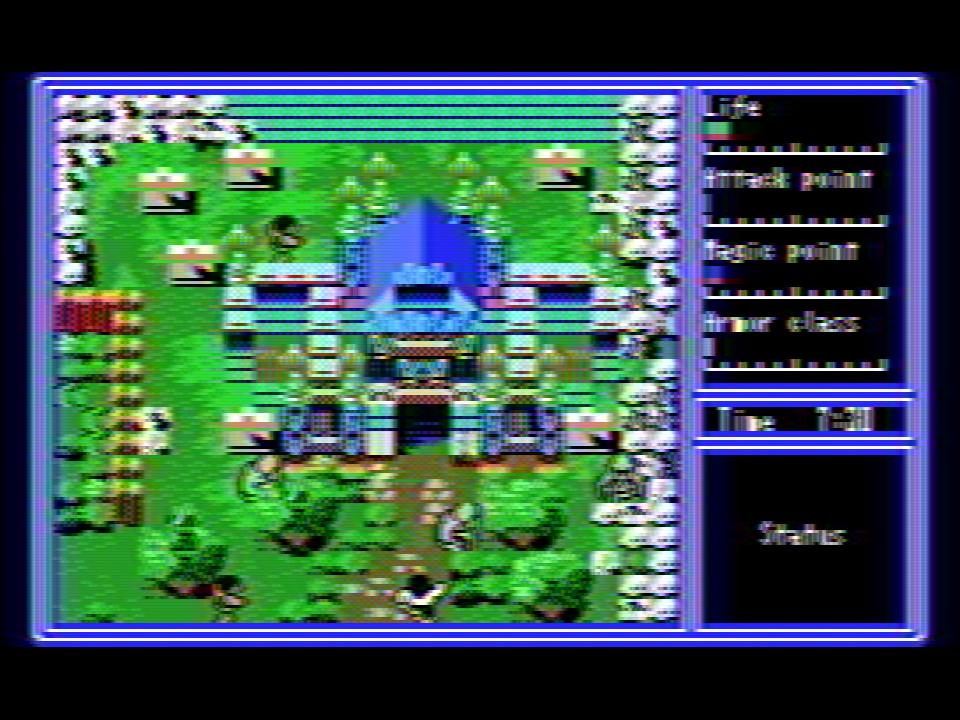

# TV shader mod for OpenMSX 1.8.0

これはOpenMSX(現在1.8.0)のTVフィルタをThemaister's NTSC shaderベースのアナログテレビ風のにじみ（クロスカラーやドット妨害）再現に変更するためのシェーダーファイルです。

## 準備 

「tv.vert」と「tv.frag」を、
「ドキュメント\OpenMSX\share\shaders」
へコピーしてください。

「ドキュメント\OpenMSX\share\」
に「shaders」フォルダが無い場合はフォルダを作成してください。

*※注) 「ドキュメント」フォルダはWindowsのユーザー毎のドキュメントフォルダです。(XP以前で言えばマイドキュメント)*

*※注) ドキュメントフォルダではなくOpenMSXインストールフォルダ配下の"OpenMSX\share\shaders"に上書きするとOpenMSXのアップデート時に元に戻ってしまいます。*

## 使用方法
準備が終わったら、

1. OpenMSX Catapultから「Start」でOpenMSXを実行
2. OpenMSX Catapultの「Video Control」タブで、「Renderer」に「SDLGL-PP」を選択
3. OpenMSX Catapultの「Video Control」タブで、「Scaler:[サイズ]x[フィルタ]」のところでフィルタに「TV」を選択

*※注) Rendererが「SDL」ではシェーダーは動作しません。*

*※注) TVフィルタでは、Scanlineは反映されますが、Blurは無視されます。*

## 滲みの調整

現状のOpenMSXのTVフィルタには、VideoControlの調整値がScanline値しか渡されず
Blur値はシェーダーには送られてこない為、シェーダー側を弄って調整する必要があります。

滲み方の調整は [tv.vert](tv.vert)"tv.vert" の、
    // If you want to adjust the amount of bleeding, please play with this value.
    #define BLUR_MILTIPLE	0.169
0.169の部分を変更して調整して下さい。  

例) 0.169 (現在)  

例) 0.200  

例) 0.300  

例) 0.400  

-----------------------------------------------
# (in English)

This is a shader file for changing the OpenMSX TV filter to a Themaister's NTSC shader-based analog TV-like bleeding (cross-color or dot jamming) reproduction.

## setup
Please copy "tv.vert" and "tv.frag" to
"Documents\OpenMSX\share\shaders"

If there is no "shaders" folder in "Documents\OpenMSX\share\", create a "shaders" folder.

*Note) The "Documents" folder is a document folder for each Windows user. (My Documents in XP or earlier)*

*Note) If you overwrite "OpenMSX\share\shaders" under the OpenMSX installation folder instead of the document folder, it will be restored at the time of software update.*

## how to use:
When you're ready

1. Execute OpenMSX with Start from OpenMSX Catapult
2. Select "SDLGL-PP" for "Renderer" in the "Video Control" tab of OpenMSX Catapult.
3. In the "Video Control" tab of OpenMSX Catapult, select "TV" in Scaler: [Size] x [Filter].

*Note) Shader does not work on ”SDL" renderer.*

*Note) The TV filter reflects the Scanline but ignores the Blur.*

## Blurring adjustment

Only the Scanline value is passed as the adjustment value of VideoControl to the current TV filter of OpenMSX.
Since the Blur value is not sent to the shader, it is necessary to adjust it by playing with the shader side.

Adjust the blurring method of [tv.vert](tv.vert)"tv.vert",
    // If you want to adjust the amount of bleeding, please play with this value.
    #define BLUR_MILTIPLE 0.169
Please change the part of 0.169 and adjust.  

ex.) 0.169 (Current)  

ex.) 0.200  

ex.) 0.300  

ex.) 0.400  

-----------------------------------------------

# 参考＆Special Thanks

http://hp.vector.co.jp/authors/VA030421/msx302.htm  
https://jp.mathworks.com/help/images/ref/rgb2ntsc.html  
http://p6ers.net/mm/pc-6001/dev/screen4color/  
http://fpgapark.com/ntsc/ntsc.htm  
https://github.com/libretro/glsl-shaders/blob/master/ntsc/ntsc.glslp 
// based on Themaister's NTSC shader
