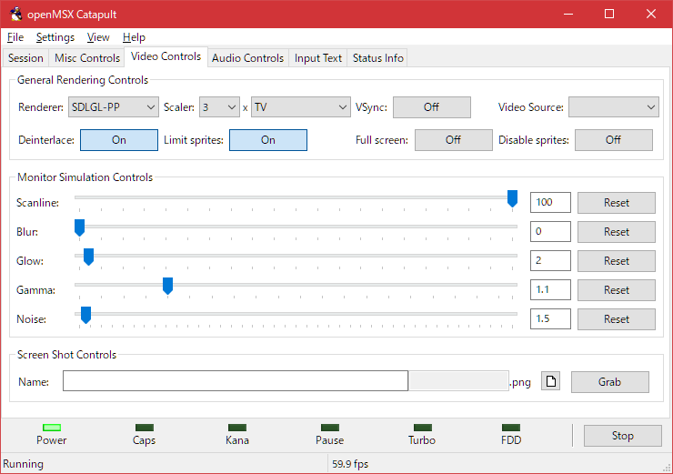

# TV shader mod for OpenMSX 1.8.0

これはOpenMSX(現在1.8.0)のTVフィルタをThemaister's NTSC shaderベースの処理を移植したものに差し替えるものです。  
アナログテレビ風のにじみに少し近くなります。

## Themaister's NTSC shader

表示時に一度NTSC信号に変換し、クロスカラー(色の干渉)やドット妨害(暗いドット)の処理を施した後にRGBに戻して表示する物です。

## 実装説明

OpenMSXがのシェーダーが1パス処理であることや、解像度の不足からブラウン管特性や、本体からの信号干渉(周期的な色の滲みだし)などは入っていません。NTSC信号の干渉処理のみです。  
無いよりは全然雰囲気が出るかと思います。

## 準備 

「tv.vert」と「tv.frag」を、
「ドキュメント\OpenMSX\share\shaders」
へコピーしてください。

「ドキュメント\OpenMSX\share\」
に「shaders」フォルダが無い場合はフォルダを作成してください。

*※注) 「ドキュメント」フォルダはWindowsのユーザー毎のドキュメントフォルダです。(XP以前で言えばマイドキュメント)*

*※注) ドキュメントフォルダではなくOpenMSXインストールフォルダ配下の"OpenMSX\share\shaders"に上書きするとOpenMSXのアップデート時に元に戻ってしまいます。*

### バリエーション

* tv_ntsc_composit_video ... 標準（OpenMSX_TV_Shader直下のものと同じ）
* tv_ntsc_vivid          ... 彩度強調
* tv_original            ... OpenMSXの素のファイル

## 使用方法
準備が終わったら、

1. OpenMSX Catapultから「Start」でOpenMSXを実行
2. OpenMSX Catapultの「Video Control」タブで、「Renderer」に「SDLGL-PP」を選択
3. OpenMSX Catapultの「Video Control」タブで、「Scaler:[サイズ]x[フィルタ]」のところでフィルタに「TV」を選択

*※注) Rendererが「SDL」ではシェーダーは動作しません。*

個人的なおすすめはScanline 75%です。

*※注) TVフィルタでは、Scanlineは反映されますが、Blurは無視されます。*

## 滲みの調整

滲み方の調整は [tv.vert](tv.vert)"tv.vert" の、
    #define BLUR_MILTIPLE   (10.625/32.0)//(8.0/32.0)
を変更することで調整できますが、Themaister's NTSC shaderと内部解像度との問題で、あまり良い調整が出来ないようです。

簡易的な彩度強調のみ追加しました。
(tv_ntsc_vividフォルダの中のtv.vertとtv.frag)

## 参考画像

1. CASIO MX-101実機をCompositeVideo接続からGV-USB2でキャプチャしたもの  

2. MSX2エミュレーションでMSX版ハイドライド3  

2. MSX2エミュレーションでMSX2版ハイドライド3  

-----------------------------------------------
# (in English)

It replaces the OpenMSX (currently 1.8.0) TV filter with a port of Themaister's NTSC shader-based processing.  
It will be a little closer to the analog TV-like bleeding.

## What's Themaister's NTSC shader?
Themaister's NTSC shader is converted to NTSC signal once at the time of display, processed for cross color (color interference) and dot interference (dark dots), and then returned to RGB for display.

## Implementation description
Due to the fact that the shader of OpenMSX is 1-pass processing and the lack of resolution, there are no CRT characteristics or signal interference (periodic color bleeding) from the main unit. Only NTSC signal interference processing.  
I think that the atmosphere will come out at all rather than nothing.

## setup
Please copy "tv.vert" and "tv.frag" to
"Documents\OpenMSX\share\shaders"

If there is no "shaders" folder in "Documents\OpenMSX\share\", create a "shaders" folder.

*Note) The "Documents" folder is a document folder for each Windows user. (My Documents in XP or earlier)*

*Note) If you overwrite "OpenMSX\share\shaders" under the OpenMSX installation folder instead of the document folder, it will be restored at the time of software update.*

### variation

* tv_ntsc_composit_video ... Standard (same as the one directly under OpenMSX_TV_Shader)
* tv_ntsc_vivid          ... Saturation enhancement
* tv_original            ... OpenMSX raw files

## how to use:
When you're ready

1. Execute OpenMSX with Start from OpenMSX Catapult
2. Select "SDLGL-PP" for "Renderer" in the "Video Control" tab of OpenMSX Catapult.
3. In the "Video Control" tab of OpenMSX Catapult, select "TV" in Scaler: [Size] x [Filter].

*Note) Shader does not work on ”SDL" renderer.*

My personal recommendation is Scanline 75%.

*Note) The TV filter reflects the Scanline but ignores the Blur.*

## Blurring adjustment

Adjust the blurring method of [tv.vert](tv.vert)"tv.vert",
    #define BLUR_MILTIPLE   (10.625/32.0)//(8.0/32.0)
It can be adjusted by changing Due to a problem with Themaister's NTSC shader and internal resolution, it seems that I can't make very good adjustments.

Only simple saturation enhancement has been added.
(tv.vert and tv.frag in the tv_ntsc_vivid folder)

## reference image

1. CASIO MX-101 captured by GV-USB2 from Composite Video connection  

2. MSX version Hydlide 3 with MSX2 emulation  

2. MSX2 version Hydlide 3 with MSX2 emulation  

-----------------------------------------------

# 参考＆Special Thanks

http://hp.vector.co.jp/authors/VA030421/msx302.htm  
https://jp.mathworks.com/help/images/ref/rgb2ntsc.html  
http://p6ers.net/mm/pc-6001/dev/screen4color/  
http://fpgapark.com/ntsc/ntsc.htm  
https://github.com/libretro/glsl-shaders/blob/master/ntsc/ntsc.glslp 
// based on Themaister's NTSC shader
