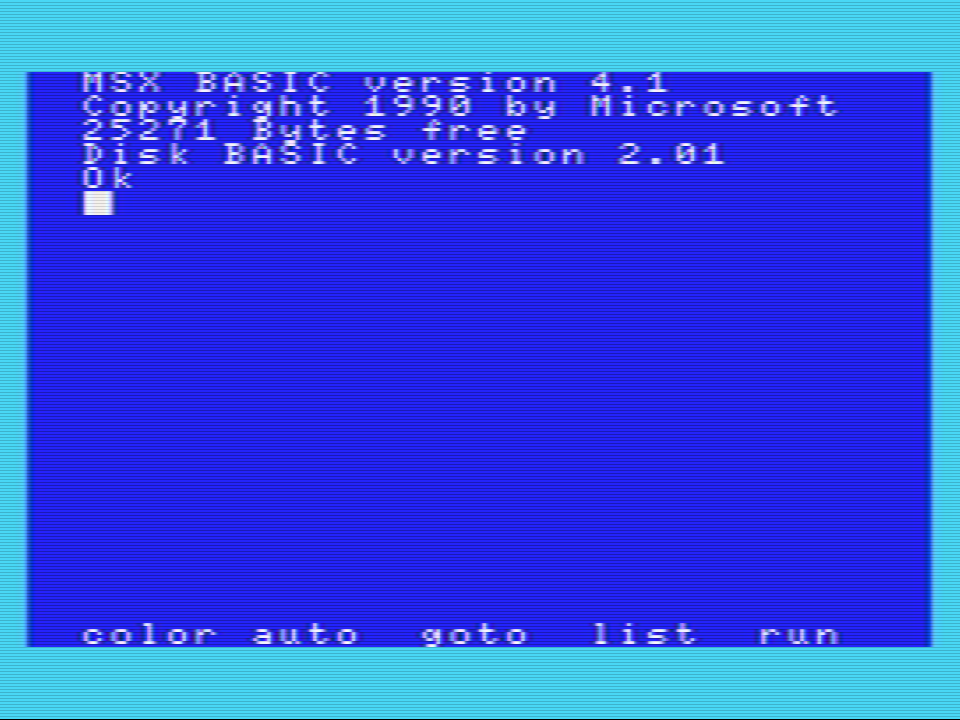

# TV shader mod for OpenMSX 1.8.0
[ReadMe in English](ReadMe_Eng.md)

これはOpenMSX(現在1.8.0)のTVフィルタをThemaister's NTSC shaderベースの処理を移植したものに差し替えるものです。  
アナログテレビ風のにじみに少し近くなります。

## Themaister's NTSC shader

表示時に一度NTSC信号に変換し、クロスカラー(色の干渉)やドット妨害(暗いドット)の処理を施した後にRGBに戻して表示する物です。

クロスカラー  

ドット妨害  

## 実装説明

OpenMSXがのシェーダーが1パス処理であることや解像度の不足から、ブラウン管特性や本体からの信号干渉(周期的な色の滲みだし)などは入っていません。

NTSC信号の干渉処理のみです。  
無いよりは全然雰囲気が出るかと思います。

## 準備 

「tv.vert」と「tv.frag」を、
「ドキュメント\OpenMSX\share\shaders」
へコピーしてください。

「ドキュメント\OpenMSX\share\」
に「shaders」フォルダが無い場合はフォルダを作成してください。

*※注) 「ドキュメント」フォルダはWindowsのユーザー毎のドキュメントフォルダです。(XP以前で言えばマイドキュメント)*

*※注) ドキュメントフォルダではなくOpenMSXインストールフォルダ配下の"OpenMSX\share\shaders"に上書きするとOpenMSXのアップデート時に元に戻ってしまいます。*

### バリエーション

* tv_ntsc_composit_video     ... 標準（OpenMSX_TV_Shader直下のものと同じ）
* tv_ntsc_no_cross_luminance ... ドット妨害なし。クロスカラーのみ
* tv_ntsc_vivid              ... 彩度強調
* tv_original                ... OpenMSXの素のファイル

## 使用方法
準備が終わったら、

1. OpenMSX Catapultから「Start」でOpenMSXを実行
2. OpenMSX Catapultの「Video Control」タブで、「Renderer」に「SDLGL-PP」を選択
3. OpenMSX Catapultの「Video Control」タブで、「Scaler:[サイズ]x[フィルタ]」のところでフィルタに「TV」を選択

*※注) Rendererが「SDL」ではシェーダーは動作しません。*

個人的なおすすめはScanline 75%です。

*※注) TVフィルタでは、Scanlineは反映されますが、Blurは無視されます。*

## 滲みの調整

滲み方の調整は [tv.vert](tv.vert)"tv.vert" の、
    #define BLUR_MILTIPLE   (10.625/32.0)//(8.0/32.0)
を変更することで調整できますが、Themaister's NTSC shaderと内部解像度との問題で、あまり良い調整が出来ないようです。

簡易的な彩度強調のみ追加しました。
(tv_ntsc_vividフォルダの中のtv.vertとtv.frag)

## 参考画像

1. CASIO MX-101実機をCompositeVideo接続からGV-USB2でキャプチャしたもの  

2. MSX2エミュレーションでMSX版ハイドライド3  

2. MSX2エミュレーションでMSX2版ハイドライド3  

-----------------------------------------------

# 参考＆Special Thanks

http://hp.vector.co.jp/authors/VA030421/msx302.htm  
https://jp.mathworks.com/help/images/ref/rgb2ntsc.html  
http://p6ers.net/mm/pc-6001/dev/screen4color/  
http://fpgapark.com/ntsc/ntsc.htm  
https://github.com/libretro/glsl-shaders/blob/master/ntsc/ntsc.glslp 
// based on Themaister's NTSC shader
