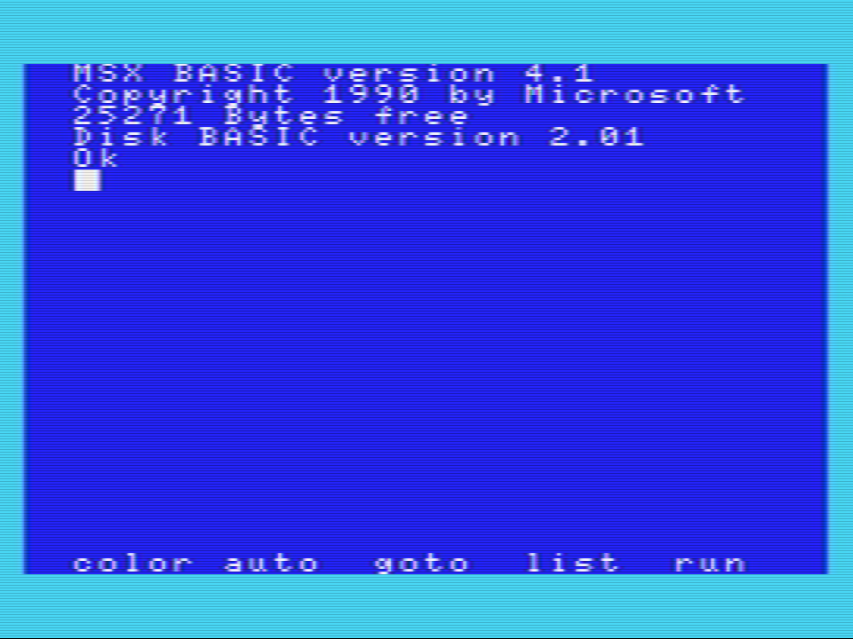
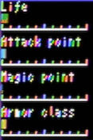
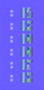
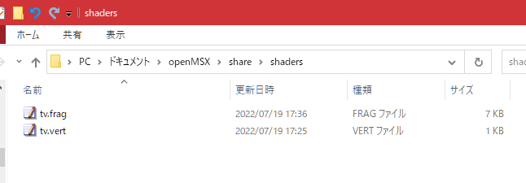
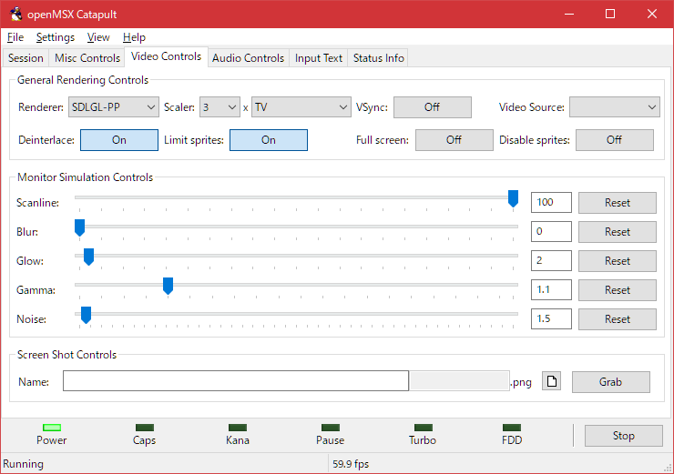
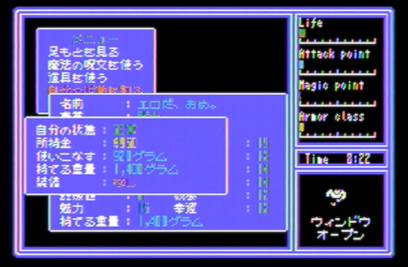
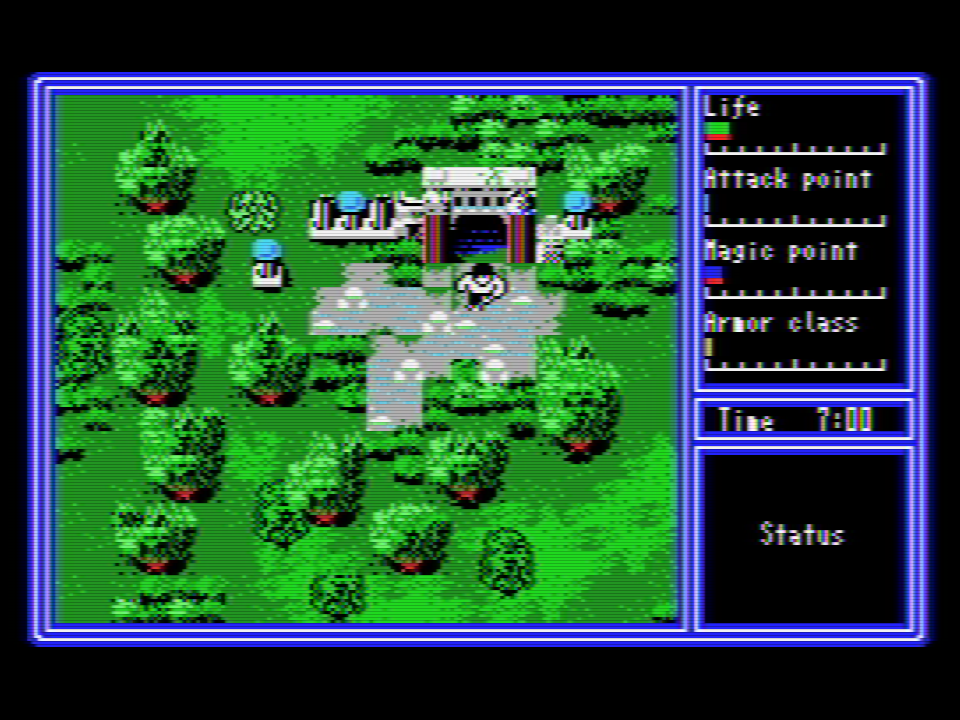
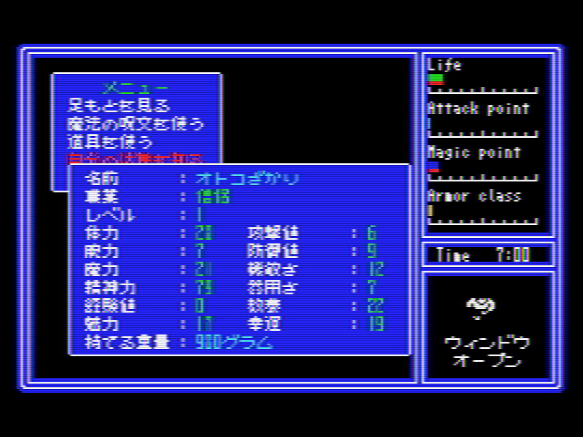
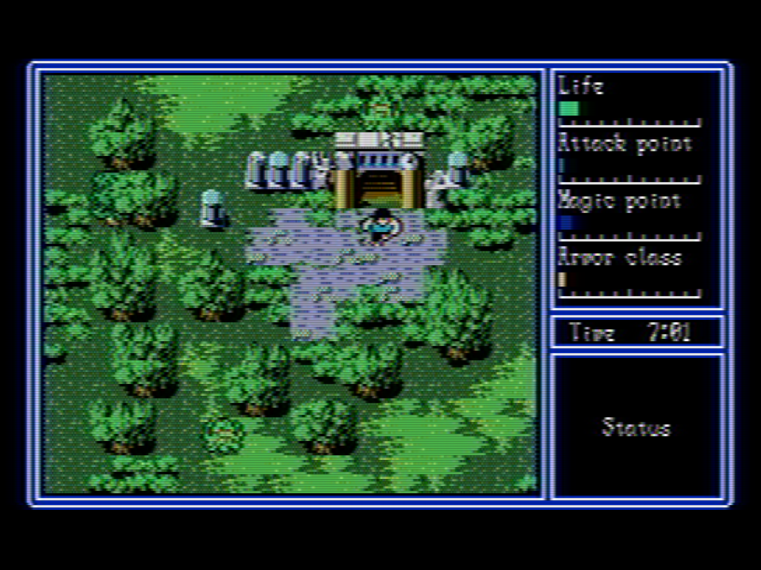
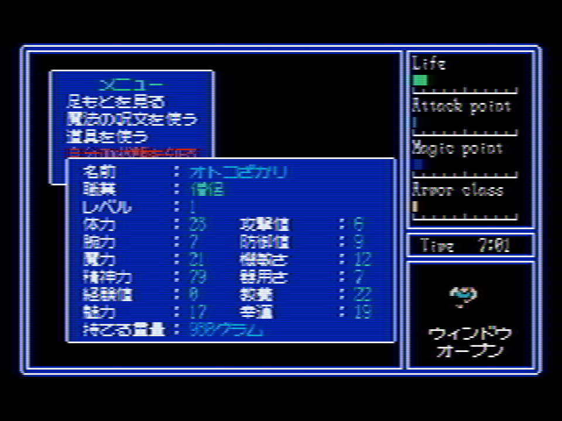

# TV shader mod for OpenMSX 1.8.0
[ReadMe in Japanese](ReadMe.md)

It replaces the OpenMSX (currently 1.8.0) TV filter with a port of Themaister's NTSC shader-based processing.  
It will be a little closer to the analog TV-like bleeding.

## What's Themaister's NTSC shader?
Themaister's NTSC shader is converted to NTSC signal once at the time of display, processed for cross color (color interference) and cross luminance (dark dots), and then returned to RGB for display.

Cross Color  

Cross Luminance  

## Implementation description
Due to the fact that the shader of OpenMSX is 1-pass processing and the resolution is insufficient, there is no signal interference (periodic color bleeding) from the CRT characteristics or the main unit.

Only NTSC signal interference processing.  
I think that the atmosphere will come out at all rather than nothing.

## setup
Please copy "tv.vert" and "tv.frag" to
"Documents\OpenMSX\share\shaders"

If there is no "shaders" folder in "Documents\OpenMSX\share\", create a "shaders" folder.

*Note) The "Documents" folder is a document folder for each Windows user. (My Documents in XP or earlier)*

*Note) If you overwrite "OpenMSX\share\shaders" under the OpenMSX installation folder instead of the document folder, it will be restored at the time of software update.*

### variation

* tv_ntsc_composit_video     ... Standard (same as the one directly under OpenMSX_TV_Shader)
* tv_ntsc_no_cross_luminance ... No Cross-Luminance, Cross-Color only
* tv_ntsc_vivid              ... Saturation enhancement
* tv_original                ... OpenMSX raw files

## how to use:
When you're ready

1. Execute OpenMSX with Start from OpenMSX Catapult
2. Select "SDLGL-PP" for "Renderer" in the "Video Control" tab of OpenMSX Catapult.
3. In the "Video Control" tab of OpenMSX Catapult, select "TV" in Scaler: [Size] x [Filter].

*Note) Shader does not work on ”SDL" renderer.*

My personal recommendation is Scanline 75%.

*Note) The TV filter reflects the Scanline but ignores the Blur.*

## Blurring adjustment

Adjust the blurring method of [tv.vert](tv.vert)"tv.vert",
    #define BLUR_MILTIPLE   (10.625/32.0)//(8.0/32.0)
It can be adjusted by changing Due to a problem with Themaister's NTSC shader and internal resolution, it seems that I can't make very good adjustments.

Only simple saturation enhancement has been added.
(tv.vert and tv.frag in the tv_ntsc_vivid folder)

## reference image

1. CASIO MX-101 captured by GV-USB2 from Composite Video connection  

2. MSX version Hydlide 3 with MSX2 emulation  

2. MSX2 version Hydlide 3 with MSX2 emulation  

-----------------------------------------------

# Special Thanks

http://hp.vector.co.jp/authors/VA030421/msx302.htm  
https://jp.mathworks.com/help/images/ref/rgb2ntsc.html  
http://p6ers.net/mm/pc-6001/dev/screen4color/  
http://fpgapark.com/ntsc/ntsc.htm  
https://github.com/libretro/glsl-shaders/blob/master/ntsc/ntsc.glslp 
// based on Themaister's NTSC shader
