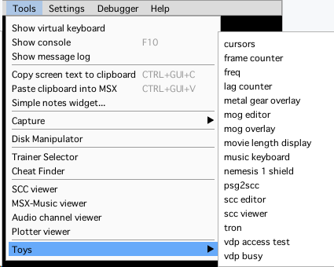
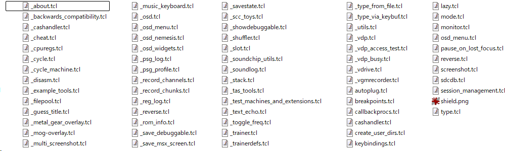

# openMSX Tclスクリプト活用ガイド

本ガイドは、openMSXのスクリプトによる自動化やデバッグ、独自のオンディスプレイ追加表示などを実際に使用して、便利さを体験できる事を目的としています。

まずは、スクリプトを使用する時に躓きやすい所をまとめていけたらと考えております。

---

## 公式リソース
詳細な仕様については、適宜公式のマニュアルを確認してください。
- **[openMSX User Manual](https://openmsx.org/manual/user.html)**: 基本的な使い方の全般。
- **[openMSX Commands](https://openmsx.org/manual/commands.html)**: 全コマンドのリファレンス。

## スクリプトコマンドとは？

スクリプトエンジンの構造は

1. **tclスクリプトエンジンによる基礎コマンド**：  
   tclの基礎コマンド
2. **openMSXによる拡張コマンド**：  
   スクリプトから呼ばれる、基礎的なopenMSX独自コマンド群
3. **share/script/\*.tcl に置かれた高度なコマンド**：
   tcl基礎コマンドとopenMSX拡張コマンドを活用し、
   便利で扱いやすい機能を実装したコマンド群

という構成になっています。

`F10`キーを押すと出てくるコンソールもtclコンソールで、コンソールからスクリプトを走査することができます。

たとえば、`reset`や`set power off`や`set power off`で電源制御をしたり、
`hda {C:\alicesoft_free_library\mufufu_games_hdd.dsk}`でハードディスクをマウントしたりできます。

また、Audio系のビューアーは、openMSX 20.0以後、C++言語とImGuiライブラリで実装された高速なものに置き換わりましたが、昔はスクリプトで書かれていました。

`scc editor`や`music keyboard`などは使ったことがあるでしょうか？  
メニューバーの**Tool**→**Toys**の中にある物が、スクリプトで書かれた便利コマンドたちです。



これは`openMSX/share/script/`にあるスクリプトで実現されていて、
ユーザーも同様に`ユーザーフォルダ/shared/script`にスクリプトファイルを置いたり、任意のパスを指定してロードすることで、openMSXに自作のスクリプトコマンドを追加したり、起動時に色んな処理をさせることができます。

## 開発の進め方

さて、どこから手を付けましょうか。  
まずは私が行っている手順を紹介します。

1. **公式を参考にする**: やりたい事に近い機能を `share/scripts` 内の公式ファイル（特に `_` 付き）から探し、キーワード検索します。
2. **改造から始める**: 見つけた `proc`（関数）の中身をコピーし、自分の名前空間（後述）の中にペーストして改造するのが最も確実な近道です。
3. **OS依存を避ける**: `$env(OPENMSX_USER_DATA)` と `file join`（またはスラッシュ区切り）を徹底して使用します。
4. **即時テスト**: 開発中はエミュレータを起動したまま、コンソールから `source` 命令でリロードを繰り返して動作確認します。

### スクリプト置き場のパスについて

#### openMSX公式スクリプト
openMSX公式スクリプトは`openMSX/share/script`です。  
中身はこんな感じです。  

#### ユーザースクリプト
ユーザースクリプトフォルダはOSによって配置場所が異なります。  

- **各OSのscriptパス**:
    - **Windows**: `C:\Users\ユーザー名\Documents\openMSX\share\scripts`
    - **macOS**: `/Users/ユーザー名/Library/Application Support/openMSX/share/scripts`
    - **Linux**: `~/.openMSX/share/scripts`

機種依存を避けるため、システム変数を使用した記述をすると便利だと思います。
- **推奨パス（正式）**: `[file join $env(OPENMSX_USER_DATA) scripts]`
- **簡略記法（スラッシュ区切り）**: `$env(OPENMSX_USER_DATA)/scripts`

## 自動読み込み・手動読み込み

openMSXで実行するスクリプトファイルは、**拡張子を必ず `.tcl` にする必要があります。** 

これ以外の拡張子では、システムの自動読み込みや補完機能が働きません。

openMSX/share/script/の中をのぞくと**ファイル名先頭にアンダースコア(`_`)** がついている物と、ついてない物があることに気づくと思います。


ファイル名先頭のアンダースコア(`_`)の有無は重要です。
これで**openMSXの起動時に読み込んで実行するかどうか**が決まります。

### ファイル名先頭のアンダースコア (`_`) の意味
ファイル名の先頭文字によって、起動時の挙動が決定します。

- 先頭にアンダースコア(`_`)**なし**  
  **起動時に読み込み実行**
    (例: `init.tcl`)

    - **挙動**:  
      起動時に自動で読み込まれ、実行されます。
    - **用途**:  
      キーの `bind` 設定、起動時の初期化、常に使うメインコマンド など。

- 先頭にアンダースコア(`_`)**あり**  
  **起動時は読み込まない**
    (例: `_library.tcl`)

    - **挙動**:  
      起動時は無視されます（あとから手動で呼び出し実行）
    - **用途**:  
      ライブラリ、特定の時だけ使う重いツール。など  
      最初から添付されている各種便利コマンドは、このタイプです。
      ヘルプやコマンドなどを既定手順で書いて置き、lazy.tcl などから、openMSXのコンソールからグローバルに参照できるコマンドとして登録されたりします。  
      （手順は後で解説します）

### sourceコマンドよるスクリプトの直読み込み
**ファイル名先頭が`_`のスクリプトファイル** や、**別フォルダにおいたスクリプトファイル** は、openMSXの起動時に自動読み込みされていません。（lazy.tclでコマンド登録している物も実行するまでは読み込みません。）

こうした未ロードスクリプトを直接実行したいときは、コンソールから `source` 命令を使用します。

- `source {C:/path/to/script.tcl}` :  
  指定ファイルを即座に実行・リロードします。  
  開発中に修正を反映させたい場合、`source`命令でリロードできます。
  
  （※ただしリロードしても、前回グローバルに常駐させたオブジェクトは残り続けます。）

## コンソール (F10) の時短テクニック

先ほどからコンソールと
openMSXのコンソールは非常に強力なシェル機能を備えています。開発の要です。

- **タブ補完 (Tab)**: コマンド名、変数名、ファイルパスを補完します。
- **履歴操作 (Up / Down)**: 上下矢印キーで、過去に入力したコマンドを呼び出せます。
- **履歴検索 (Ctrl + R)**: 過去の入力履歴からキーワードで検索できます。
- **行頭・行末移動**: `Ctrl + A` で行頭へ、`Ctrl + E` で行末へジャンプします。
- **状態確認**: 単に `set 変数名` と打てば、現在の値を即座に確認できます。

## 移植性を高めるパス操作と環境変数
どのOS（Windows/Mac/Linux）でも動かすための必須作法です。

- **OSの差を吸収する `file join`**
    - `set path [file join $dir "data" "test.dsk"]`
- **スクリプト自身の場所を取得**
    - `set base [file dirname [info script]]`
    - 自身の隣にあるファイルを相対的に指す際に必須です。
- **システム変数の活用**
    - `$env(OPENMSX_USER_DATA)`: ユーザー設定・保存用フォルダを取得。
    - `$env(OPENMSX_SYSTEM_DATA)`: openMSX本体のインストールフォルダを取得。

## Tclの「マジックワード」と特殊記号
初心者が特につまずきやすい、TclおよびopenMSXスクリプト特有の記述ルールです。

### 基本コマンド
- **`set` / `unset`**: 変数の代入と削除。
- **`incr`**: 数値を加算。 `incr count`
- **`expr`**: 計算命令。 `set a [expr {$b + 1}]` （これを通さないと計算されません）
- **`pwd` / `cd`**: 現在の作業ディレクトリ（カレントディレクトリ）の表示と移動。

### 記号の意味
- **`$` (変数展開)**: 変数の中身を参照します。
- **`[` `]` (コマンド置換)**: カッコ内を先に実行し、その結果を外側に渡します。
- **`{ }` (グループ化・非展開)**: 中身を一塊として扱い、内部の変数展開は行いません。
- **`"` `"` (グループ化・展開)**: 中身を一塊として扱い、内部の変数（`$`）を展開します。
- **`\` (エスケープ / 行継続)**:
    - 特殊記号を文字として扱う（例: `\$`）。
    - 行末に置くことで、長い命令を次の行へ継続させます。

### データの扱いと実用例
- **16進数**: `0x` を付けた値（例: `0xD000`）は数値として計算可能です。比較は `[expr {$addr == 0xD000}]` 内で行います。
- **リスト操作**: `lindex` (取得)、`lappend` (追加)。メモリデータの加工に多用します。
- **ファイル操作**:
  | 処理               | 記述  |
  |--------------------|-------|
  | ファイルの存在検査 | `if {[file exists $path]} { ... }` |
  | フォルダの作成     | `file mkdir [file join $env(OPENMSX_USER_DATA) "logs"]` |
  | テキストの読み込み | `set f [open "info.txt" r]; set data [read $f]; close $f` |
  | テキストの書き込み | `set f [open "out.txt" w]; puts $f "内容"; close $f` |
  | テキストの追記     | `set f [open "log.txt" a]; puts $f "追記データ"; close $f` |
- **制御構造のスペース**: `if` や `for` の条件式 `{ }` の前後には必ずスペースが必要です。

## 名前空間 (namespace) の活用

他の機能との競合を避け、公式コマンドのような振る舞いを実装するための手順を書いていきます。

### 名前空間を使用する目的と利点

1. **競合の防止**:  
   自分専用の領域を確保し、他の関数を誤って上書きする事故を防ぎます。

2. **【重要】variable と set の使い分け**:  
   名前空間内の `proc` から共通変数にアクセスする場合、  
   必ず冒頭で `variable 変数名` と宣言してください。  
   `set` だけでは**関数内ローカル変数**になるので関数を抜けると値が破棄されます。

3. **再読み込み時の初期化対策**:  
   `source`命令でリロードしても値を保持したい場合は  
   `if {![info exists count]} { variable count 0 }`  
   のように記述します。

4. **コールバックの参照**:  
   `namespace code` を使うことで、外部イベントから自作関数を確実に実行させることができます。

### エイリアス（別名）による名前衝突回避：実装例
```tcl
namespace eval MyTool {
    variable count 0
    proc increment {} {
        variable count
        set count [expr {$count + 1}]
        puts "Count: $count"
    }
}
# mt_inc という短い別名で登録。
# 既存の increment コマンドとの競合を避ける。
interp alias {} mt_inc {} MyTool::increment
set_help_text mt_inc "MyToolのカウントを1増やします。"
```

## 公式スクリプト＝逆引きの実践カタログ
`share/scripts` 内の公式ファイル（主に `_` 付き）は、最高の機能サンプル集です。

### サウンド・ミキサー制御
- **`_mixer_widgets.tcl`**: `mixer` コマンドによる音量・バランス制御の基本。
- **`vgm_recorder.tcl`**: 音源チップごとの録音・チャンネル管理の自動化。
- **`_music_keyboard.tcl`**: `debug read` でチップ内部を読み、鳴っている音階を取得する手法。
- **`_sound_log.tcl`**: 特定の音源のみをファイルに記録する手法。

### デバッグ・解析・出力
- **`_show_poked.tcl`**: `debug set_watchpoint` によるメモリ変化監視の決定版。
- **`_disasm.tcl`**: `debug disasm` による実行中コードの逆アセンブル出力。
- **`_vdp.tcl`**: VDPレジスタの状態読み出し。
- **`_reg_display.tcl`**: CPUレジスタ値をリアルタイムに取得・表示する手法。
- **`_screenshot.tcl`**: `screenshot` コマンドの管理や連番保存、PNG/BMP形式指定の制御。

### 画面表示 (OSD)
- **`_osd_widgets.tcl`**: `osd create` でFPS、メッセージ、メーターを画面に重ねる。
- **`_leds.tcl`**: 本体のLED状態（CapsLock等）に連動して描画を更新する手法。
- **`_visualmsx.tcl`**: MSXの画面上に独自のグラフィカルUIを構築する高度な例。

### 自動化・イベント制御
- **`_autofire.tcl`**: `after`（周期実行）と入力コマンドによる連射実装。
- **`_autopause.tcl`**: フォーカス外れ等のエミュレータイベントを検知・制御。
- **`_reverse.tcl`**: openMSXのリバース（巻き戻し）機能とスクリプトの同期制御。
- **`_callback.tcl`**: 画面更新やステートロード等のイベントに対するコールバック登録。
- **`_training.tcl`**: ユーザー入力をリストに記録し、繰り返し再生。
- **`_auto_save_state.tcl`**: `get_info time` で時間を取得し、自動セーブする手法。

### システム・メディア操作
- **`disk_utils.tcl`**: `diskmanipulator` を制御し、DSK内のファイルを操作。
- **`_rom_info.tcl`**: 内部データベースから実行中のソフト情報を取得。
- **`_openmsx_utils.tcl`**: バージョン比較やOS判定など、互換性維持に役立つ関数。

### lazy.tcl による効率的なコマンド管理
- **役割**: openMSXの起動時間を短縮するための仕組みです。
- **動作**: 起動時にすべてを読み込まず、コマンドが実際に呼ばれた瞬間に該当ファイルをロードします。
- **利点**: 自作スクリプトを `_` 付きで保存しこの仕組みに乗せることで、ツールが増えても起動が重くなりません。