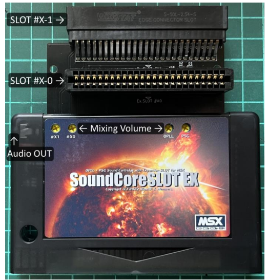
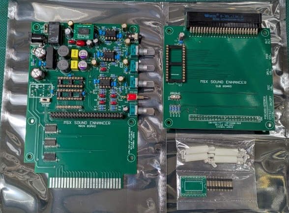
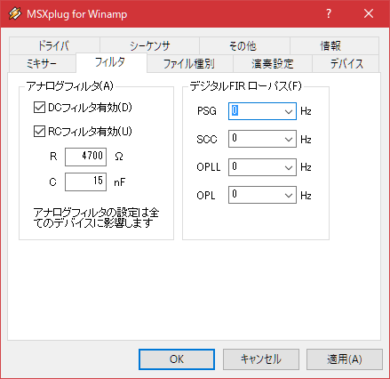
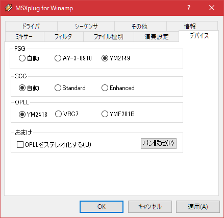
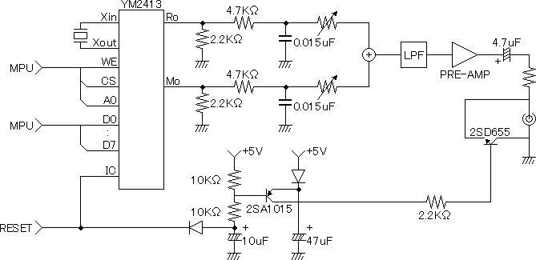
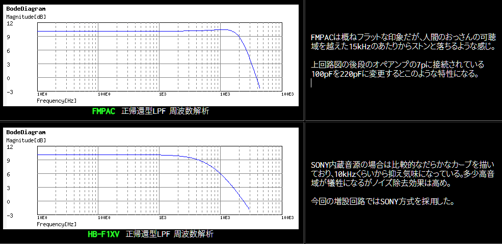
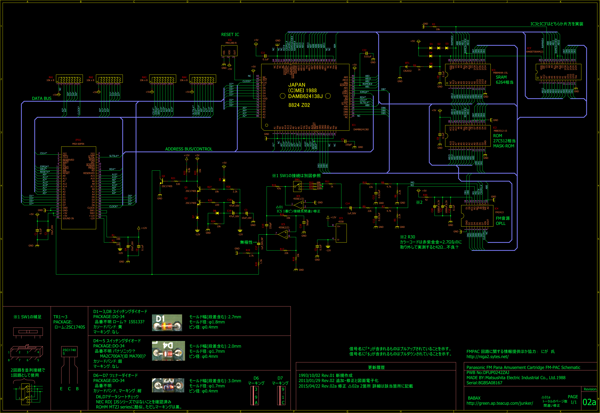
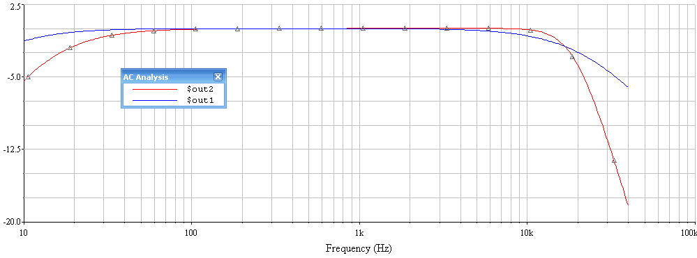
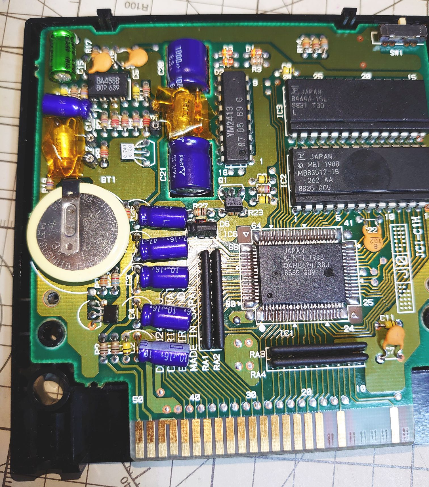
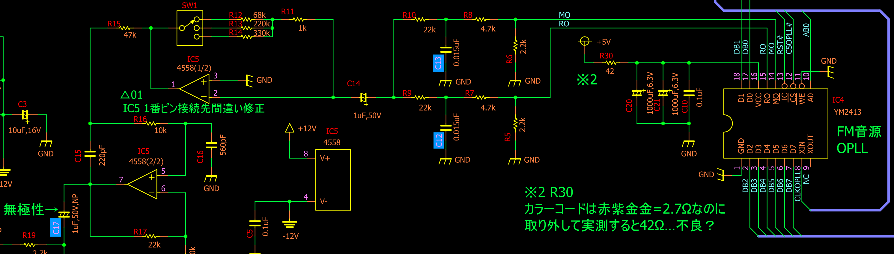

> [!WARNING]
> **工事中**
>
> 間違いや勘違いが明らかで訂正が必要な箇所や、
> 検証が必要な箇所を含みます。

# MSXの音源：環境による音の違い

現代の状況に合わせて、グループでまとめる試み。

実際に使ったり聞いてりした感触を補足で添えてあるが、  
あくまでも筆者の感覚なので、違う感じ方の人も当然居ると思う。

その点はご了承頂きたい。

---

## 1. 癖が強いフィルタ

良い音が出るけど、独特過ぎて、データの互換性に心配がある物。

- **blueMSX**

  ]

  http://bluemsx.msxblue.com/jindex.htm

  → blueMSXで作った楽曲データは、他の環境で同じようには聞こえない。

  2009年で更新が止まっているが、総合的にはopenMSXよりも安定して使いやすい。  
  何よりキーボードの問題が無い。

  音が太く伸びて低音がかなり響く。

  とても良い音が鳴るが、良い音が鳴りすぎとも言える。  

> [!CAUTION]
> OPLLのリズム音が小さいのは致命的な問題。  
> Vコマンドで言えば約4ぐらい低いため、他の環境で聞くと泣く可能性が高い。

個人的にはこのようにアンプで音を弄りまくった音を聴くのは好きだが、  
エミュレータ側でそれに固定されてしまうと問題がある。

---

## 2. アナログフィルタ無し

チップの出力そのままに近い音とされる。

昔の高音質化改造と言われた物の最終地点でもあり、  
blueMSXとは対極にある音。

チップチューンを探求する人間であれあば、  
アナログフィルタは各自で行うという方針ではあるが、  
一般的な利用ではそのままで使う事が殆どだと思われる。

実際、エミュレータはソフトハード問わず、アナログフィルタ部分が提供されていない物が殆ど。

実機向けの演奏データを作りたい場合には、
blueMSXと同質の問題を抱えている。

> [!NOTE]
> これを高音質化と言うのは疑問もある。
> 
> 無改造の実機で表現可能な音を全域カバーできる訳ではなく、  
> 音色そのものが変わるというのが実態。
> 
> 音の変化としては、高周波域が増加するものの、中音域が弱くなる傾向がみられる。  
> 良いトコ取りとはいかない様子。
>
> 実際、
> 既存の曲データを聴いていると
> 実機に比べて音が悪くなったと感じる事もある。
> 
> 例えば、 
> 元は聞こえなかったノイズが大量に発生したり、  
> 音量バランスが破綻したりといった事が起きる。
> 
> これは音の互換性・再現性としては問題であり、  
> 高音質化と言いきれない部分である。

> [!CAUTION]
> 音域によってはVコマンドで1～2の違いがある。  
> OPLLリズム音などは特に分かりやすい違いが見られる為、  
> 実機向けのデータを作成したい場合は注意が必要。

- **openMSX**  

  https://openmsx.org/  

  

  互換性の高いNuked YM2413を採用  
  version 20.0でGUIを刷新。  
  強力なデバッガや各種機能が統合され、非常に使いやすくなった。  
  一方でキー入力できないキーが存在するという致命的な問題は未解決。  
  （昔は使えたのに何故変えたのか…）

- **1chipMSX**

    

  （クローン：ZeminaxNeo、SM-X、SX-1、SX-1 mini、SX2、SX-E、SX-LITE等も同様）  

  ※ 公式版はVDP、PSG、OPLL全てに問題がある為、OCM-PLD改への書き換え推奨

  > 公式版は互換性が低く実用には厳しかったが、添付されたファームウェアをユーザーが修正することができた為、有志が10年近く改良を続け、現在では最も使いやすいMSXと言っても過言ではない。

  > SDカード対応、VDPの高速コピーモード、実行時の動作クロック変更、外部スロットの実行時切替など非常に有用な機能を搭載。

  最新ファームウェアは OCM-PLD 3.9.1で、MSX++の呼称を送られている。  
  ※ 3.9.2は現在正式リリースに向けてテストを重ねて準備中。  
  https://gnogni.altervista.org/

  - PSGやOPLLの音量ミキシング問題を修正済み。  
  - OPLLは最新のVM2413。

- **MSXPlay**（MSXPlug）

  https://msxplay.com/editor.html  
  
  MSXPlayはlpf=1でアナログフィルタも使用可能。
  デフォルトはフィルタ不使用。

  lpfとあるが実装は[積分回路](#opllと積分回路)に相当する。
  （MSXPlugでのRCフィルタ部分）

  作り込んだデータはアナログフィルタの有無によって互換性が無い場合があり、  
  特にリズムパートやギリギリの音色を責めると、問題が起き易い。

  データ制作時はその辺を意識しておくと、泣かなくて済むかもしれない。

- **ハードウェアエミュレーション音源**
 
  FPGAやPICを使用した音源。

  - OPLLの場合、現行品ではアナログ音声フィルタ部分まで再現したものは無い様子。  
    （実チップを使用したFMPAC互換カートリッジはアナログフィルタを実装してたものがあるかも）

  - SCC音源も独特な仕様から起きるノイズの再現は困難。  
    IKASCCは再現できる可能性があるが、デキャップしても分からない、パーツ仕様のブラックボックス部分が絡んでいるため、アクセスタイミング遅延の調査によるパラメータ調整が必要。

- **コンデンサC12、C13を除去したFMPAC**

  [積分回路](#opllと積分回路)を除去したもの。

  各種環境が整った現在では、せっかくのFMPAC実物をわざわざエミュレーション音源に近づける意義は少ないと思われる。

  正直言って、勿体ない。

### 補足

現在入手しやすいハードウェアエミュレーションや、チップサウンド演奏デバイスなども
乗算回路やLPFを除去した物が主流になりつつあり、一定のシェアが出来つつある。

> ちなみに、1chipMSXも乗算回路が搭載されていない。  
> （個人的には互換機を名乗るのであれば搭載して欲しい所）
> 
> 1chpMSX3がどうなるかは現在不透明だが、  
> 公式互換機でも乗算回路やローパスフィルタなどのアナログフィルタを搭載しない方向なのであれば、  
> アナログフィルタ無し環境向けデータも今後増えていくかもしれない。

外部ノイズの除去と乗算回路やLPFを除去した音を望む場合、  
エミュレーション精度が上がった現在は
openMSXなどのエミュレーション音源が選択肢に入るようになった。

---

## 3. 従来の「高音質化改造」と言われるもの

[積分回路](#opllと積分回路)やLPFの効果を弱めにする改造が施された実機・デバイス。

低中音域で尖った音が出て、高音域でいきなり音が詰まる。という半端な調整になり易い。

積分回路を除去した場合と同様に、  
無改造状態で表現可能な音を全てカバーできるわけではない。  
（音量バランスも当然別物）

これを高音質化と言うのは疑問が残る所。

> [!NOTE]
> 実機の場合は外部ノイズのほうが深刻な課題であり、アナログフィルタを弄っても改善されない。
> 
> 高音質化改造の中には外部ノイズ対策が含まれているものあるが、完全に排除できるわけではない。  
> （コンシューマ機ほどノイズ対策情報が多くない）  
> 良く見かけるものはフィルタの変更がメインの改造になっている。  

- **実機に対する音質改善改造**
 
  http://frs.badcoffee.info/hardware/MSXfixes.html 等

- **FMPACに対する音質改善改造**

  C17：1μF→4.7μF 50V 無極性  
  C12、C13：0.015μF→1500pF  等

他の問題点として

- 改造方法によっても音の特性がまちまち。
- ハードルが高く、実行する人は少ない。

など、同じ環境で聞ける人が少ない事があげられる。  

精度の高いエミュレーション音源や、  
ノイズ排除タイプの高音質音源カートリッジの出現により、  
危険を冒してまで従来の高音質化改造に挑む意義は薄くなったように思う。

> [!NOTE]
> ### もう少し補足
> 
> 過去にこの改造をしていた人は、自分で音楽データ制作をしていた人が多い。
> 
> 出音の幅を広げたくて、一つの可能性として実行されたものであり、  
> フロンティア精神で暗中模索の中、試みられていた改造。
> 
> 実行する人が少なかったため、副作用を気にする（気になる）人が少なかったし、  
> 自作データを録音して発表するのであれば、互換性は気にしなくて済むというのもあった。

> [!NOTE]
> ### 番外：OPLLでの音作りに対する個人的な考え
> 
> [積分回路](#opllと積分回路)に使用される0.015μFは必要以上に強いという説があるが、  
> 段階的に容量を変えて聞き比べた感想としては、  
> 魅力的で色気のある音に変わる分岐点で、とても良い選択のように感じた。
> 
> （高音質化改造が中途半端に感じたのも、この聞き比べの結果。
>  加えて、各自で違う容量を採用していると、せっかく作った音が変わってしまう。これはあまり望ましい事だと思えない。）
>
> OPLLの音は2オペなので音色パラメータを弄った時の表現の幅は狭いため、  
> 積分回路による音の変化が加わることで幅が広がるように思う。
> 
> 音作りの選択肢としては
> 1. フィルタ無しでギリギリを攻める
> 2. 積分回路とセットで中音域のなめらかな伸びを引き出す
>
> のどちらかの選択肢が良いように思う。  
> 残念ながら両立は難しい。
> 
> その点、フィルタを弱めに調整する改造は、
> 音作りに対するメリットが最も少ない。再現性も低い。
>
> 音がこもっているという感想がLPFに起因するのであれば、  
> 積分回路（0.015μF）を弄るよりも、
> LPF（220pF）を変更する方が良いように思うが、  
> その場合も結局は音の特性が変わるだけで、音質の改善とは言い難い。
> 
> （ちなみに、HB-F1XVのLPFは100pFを使用していて、FMPACよりも低い周波数帯域から滑らかに減衰するとのこと。）

## 4. ノイズ対策のための高音質化カートリッジ

**個人的に強くお勧め**

ノイズの問題はFDDや映像からのノイズの混入などで、対策改造が難しい。  
その問題を解決するべく、新しいカートリッジが発表されている。

本体のノイズから分離されたノイズフリーな音をカートリッジから出力可能なデバイス。

各音源のミキシング音量バランスが調整可能になっていて、  
機種毎の音量バランス違い問題も解決。

MSXでの音楽演奏に付きまとう様々な問題を解決してしまう
令和のスーパーアイテム。

同じデバイスを購入すれば、誰でも同じ音で聞く事ができる。

- にがさんの「**SundCoreSlotEX**」（通称：核スロ）  
  http://niga2.sytes.net/sp/coreslot.pdf  
  

  > 本機は MSX 対応の FFM+PSG 音源付き拡張スロットです。
  > YAMAHA の音源LSI「YM2413」と「YMZ294」を搭載。
  > MSX-MUSIC 互換、本体内蔵 PSG 互換ですので、
  > 従来のゲームソフトやアプリケーションで低ノイズの綺麗なサウンドをお楽しみいただけます。

- Lost Technologyさんの「**MSX SOUND ENHANCER**」  
  https://sites.google.com/site/lostechmsx/home/products/msx_sound_enhancer_rev2  
  

  > 「MSXの機種ごとに音量バランスやら音質やら信号特性やらがバラバラ」な問題を解決！  
  > 主な特長  
  > - 実音源チップ（PSGおよびFM音源）をボード上に搭載  
  > - 既存ソフトと（だいたい）互換
  > - PSG/OPLL/SCCの音量を独立して設定可能
  > - 機種ごとにバラバラな音声特性を改善
  > - サラウンドプロセッサ搭載により疑似ステレオ化
  > - 外部電源の供給により高音質を実現（ACアダプタ別売り）
  > - 音源のマスタークロックを外部から供給可能（オプション）
  > - YMF281、YM2423などのOPLLファミリーを既存ソフトで駆動可能（オプション）

> [!CAUTION]
> 設計思想的にアナログフィルタ部分も再現してあると思われるが、  
> 当方は未確認の為、動画などを各自参照して判断されたし。

---

## 5. アナログフィルタを使用可能なエミュレーション音源

- WinAMP + MSXPlug または、kbMediaPlayer  
  https://github.com/digital-sound-antiques/in_msx  
  https://kobarin.sakura.ne.jp/kbmedia/kbmedia.htm
  
  - RCフィルタ（LPF）の有効化・無効化・パラーメータ調整が可能。  

      
    （プラグイン設定>フィルタ>アナログフィルタ>RCフィルタ）

    - OPLLが実機に近い音になる。
      （このRCフィルタは[積分回路](#opllと積分回路)に該当するフィルタなので）
    - ただし、PSGやSCCも含めて全体に掛かってしまう。
    - デフォルトではOFFになっていることが多い。
  - PSGのタイプをAY-3-8910かYM2413（MSX-Engine/SSG）から選べる  
    

- m3Disp  
  https://m3.ym2413.com/
  
  内部的にはMSXPlugを使用。  
  設定変更機能は無い。
  - デフォルトはDCフィルタのみでOFF?
  - PSGタイプはおそらくYM2413(SSG)

- MSXPlay  
  https://msxplay.com/editor.html
  
  - 内部的にはMSXPlugを使用。  
  - MML拡張指定でlpf=1を指定すると
    [積分回路](#opllと積分回路)に相当するフィルタを利用可能。
  - ただし、PSGやSCCも含めて全体に掛かってしまう。

音源エミュレータの中では、実機との違和感が最も少ない。  
（というよりも他に実機に近い音を出せるものが無い。）

---

## 6. 無改造実機

フィルタのかかり具合や、音量バランスは機種でまちまちで、
これがとても悩ましい問題になっている。

機種によってはノイズが激しかったり、
経年劣化で音が壊れてしまう機種もあり、なかなか大変。

> [!NOTE]
> 上に挙げた最近の「ノイズ対策型 高音質音源カートリッジ」は、
> ノイズ・音量バランスの問題を一気に解決してくれるので、
> 長年悩んできたユーザーほど、
> これが如何に有り難いスーパーアイテムなのか実感できると思う。

以下、機種毎の特徴（一部うろ覚え）

- サンヨー MSX2+
  
  - PSGが大き目。  
  - OPLLの音はシャープな印象。

- ソニー MSX2+
  
  - PSG音量は中間ぐらい。
  - OPLLはこもりがちで、代わりに中音域が伸びる印象。
  - OPLLの音量自体は半固定抵抗で変更可能。
  - 経年劣化していく問題が有名。

- パナソニック MSX2+/turboR
  
  - PSGは少し小さめ。
  - フィルタはサンヨーより強く、ソニーより弱い印象。（要：検証）
  - 映像端子のつなぎ方によってはノイズが多い。

  **A1GT**は**A1WX**よりもノイズが多いという評判で、
  実際に使って見た感じ確かにそうかもしれない。

- MX-101（番外）
  
  - PSGはカスタムチップでSSGに近い。  
  - 外部音源に対してPSG音量がかなり低い。
    （Vコマンドで4ぐらい違う。）  
  - SCC音源を使用したゲームだとPSGパートがほぼ聞こえない。
  - PSGの汎用I/Oの仕様が一部未実装。

  一つの歴史的転換点だけども、使い勝手自体はいまいち。

  筐体が梨地加工でベタつかないのは評価点。

- MX-10/FS-A1（番外）
  
  - バランスが良い。  
  - 本体がコンパクト。  
  - MX-10のPSGはGI AY-3-8910  
  - A1はMSX-ENGINE（SSG）  
  - OPLLはFMAPCを使用する。（MX-10はKB-10か12V電源の追加が必要）  
  - どちらも電源アダプタが特殊。

> [!NOTE]
> ### FMPACの音量
> 内蔵機種に比べて音量小だと小さすぎ、中だと大きい為、意外と取り扱いが難しい。
>
> 
> ### アンプ増幅回路の違い
> |機種|増幅量|
> |---|---|
> | FMPAC | 小が約3倍、中が5倍、大が10倍 |
> | Panasonic FS-A1WX | 7倍固定 |
> | SONY HB-F1XV | 半固定抵抗で0～20倍 |
> 
> 参照元：http://niga2.sytes.net/msx/A1RED_KAI.html

---

# OPLL(YM2413)のアナログフィルタ（積分回路、ローパスフィルタ、ハイパスフィルタ）

## OPLLと積分回路

> YM2413アプリケーションマニュアルより引用  
> http://d4.princess.ne.jp/msx/datas/OPLL/YM2413AP.html
>
> 4-2.オーディオ出力
OPLLの音声出力は、以前に記述されるようなパルス信号のため、外付けの積分回路が必要です。この積分回路の出力(またバッファー)は、オーディオ・アンプに直接接続されるでしょう。また、積分回路とアンプの間に低域フィルター(遮断周波数: 20kHz程度)を挿入することにより、ステップノイズを削除することができ、高音質化が計れます。電源ON/OFF時にノイズが発生するため、オーディオ機器(アンプやスピーカー)を保護する回路が必要です。  
>   
> 図4-2 オーディーインターフェース

PCM等は複数ビットで構成されたデジタル信号レベルが出力されますが、YM2413の出力は1ビットのパルス信号なので、D/A変換の為に外付けの積分回路を使用するという事らしい。

積分回路の後に低域フィルター（=ローパスフィルタ/LPF）を挿入するのは積分回路を通しても残りやすい高周波帯の[ステップノイズ](#ステップノイズ)を削減するためらしい。
積分回路の補強的な役割だろうか？

積分回路自体、RCローパスフィルタと言われるものと構造が似ているように思う。
（実際、最初は積分回路の部分をローパスフィルタだと思っていた）

> #### ステップノイズ
> 階段状の変化をする信号は連続的な変化の中で尖った成分が混じっているように感じる。
> 
> コンピュータグラフィックスで言えばエイリアシングやジャギーなどと呼ばれる物で、アンチエイリアシングが積分回路に相当。

## にがMSX ～ FS-A1の改造 ～

http://niga2.sytes.net/msx/A1RED_KAI.html

にがさんのFS-A1改造記事

A1にOPLLを内蔵する部分で、OPLLの積分回路、LPF、アンプそれぞれの各機種での実装について詳細な説明と解析結果が記されている。

> ### FMPACとHB-F1XVのLPF比較
> 
> （にがさんの記事より引用）
> 
> ソニーはカットされる範囲が多めで丸く太い音という印象があったが、実際にデータで確認することが出来た。
>
> FMPACのLPFはR16(10kΩ)+C15（220μF）だと思われる。

## FMPAC SW-M004 回路図

[BABAXさん](https://x.com/bax01tw)制作のFMPAC回路図  

（リンク切れ）https://green.ap.teacup.com/junker/160.html

（teacupのホームページサービス終了に伴い、幾つかの記事はblogに移植されてるものの、FMPACの記事は不明。）

幸い回路図は現在のblog管理下に移行されている。  
https://elec-junker-p2.blog.jp/tea/FMPAC_02a.pdf  

### よくあったFMPAC音質変更改造

以前教えてもらったのが  
- C17：1μF→4.7μF 50V 無極性
- C12、C13：0.015μF→1500pF

という改造。

ローパスフィルタと見なした場合のグラフ。  
（※ 変更後の特性が赤）  
  

改造後のFMPAC基板  
（※ C12、C13はICソケットプラグに変更して抜き差ししやすくしてある）
  

実際にこの変更を行って色々聞き比べた結果、  
C12、C13は外してしまうか、元の0.015μFのどちらかが良いというのが個人的な感想。  

外した場合は、エミュ―レータに近い音が鳴る。

 (回路図より該当箇所付近を一部抜粋)

#### FMPACの積分回路

こうしてみると、C12、C13（0.015μF）は積分回路部分だと思われる。  
（R7、R8の4.7kΩ抵抗と合わせて構成される回路）  
ローパスフィルタではないものの、ここを変更すると音の丸みが変化する。  
（効果的にはRCローパスフィルタも兼任している？）

#### FMPACのLPF（ローパスフィルタ）

LPFはR16(10kΩ)+C15（220μF）と思われる。  
（にがさんのA1改造記事内、FMPACとHB-F1XVのLPF比較のコメント参照）

#### FMPACのHPF

C17は記憶が確かならHPFに相当する。  
（起動時に出る低音域の大きなノイズを抑制する）

#### FMPAC改造について

あくまでも経年劣化する電解コンデンサ交換のついで実行してみたもので、  
改造しても音質は良くなる訳ではなく、音が変わるだけなのが分かった。  
交換して実験できるようにするのは面白いが、  
結論的には改造しなくて良いと思う。

本体やFMPACを改造するよりも、ノイズや音量バランス対策のされた高音質カートリッジをお勧めしたい。

また、1chipMSXやOpenMSXで作成されたものを実行（演奏）するであれば、エミュレータが適している。

→ カン違い等、ご指摘いただければ幸い。
